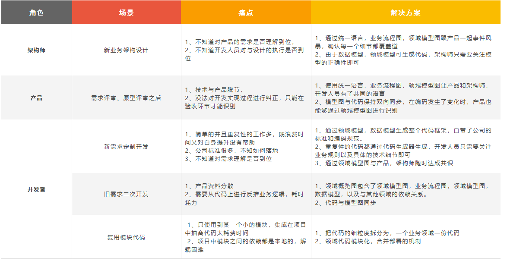
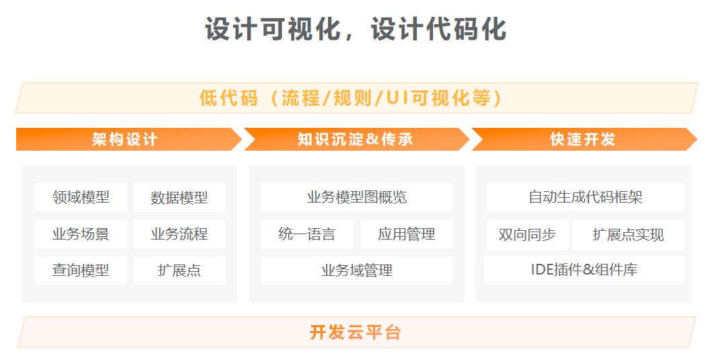
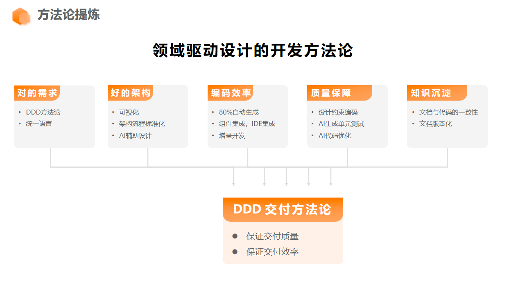
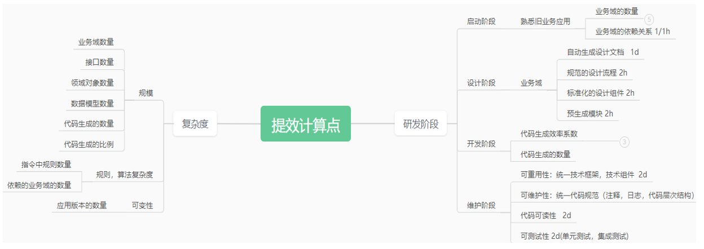

# 产品简介

## 1、系统介绍

DDD可视化开发平台是一款基于领域驱动设计思想的可视化开发工具，支持多种领域模型设计方式，
提供丰富的可视化工具和组件，支持自动生成代码，支持多种编程语言、数据库和开发框架，
可以帮助开发者快速构建高质量的软件系统。

应用场景如下：

## 2、产品蓝图

## 3、名词概念

组织： 组织可以对应租户、企业的概念，在组织下面可以挂靠多个团队。

团队：每个团队是单一职责的，通常负责独立子领域的开发工作。

业务域：可以理解为 DDD 中 ‘子域’ 的概念。也可以是业务模块，表示特定范围内的业务问题。在我们的开发平台中，一个业务域就是一个领域建模结果。

业务场景：主要表现形式就是一个业务流程图，用于表示特定业务场景下，各个角色的交互行为。

应用：应用可以理解为微服务、限界上下文之类的概念，这是程序运行、脚手架生成、代码同步的基本单位。由多个业务域聚合而成。

### 方法论提炼

### 价值衡量指标
