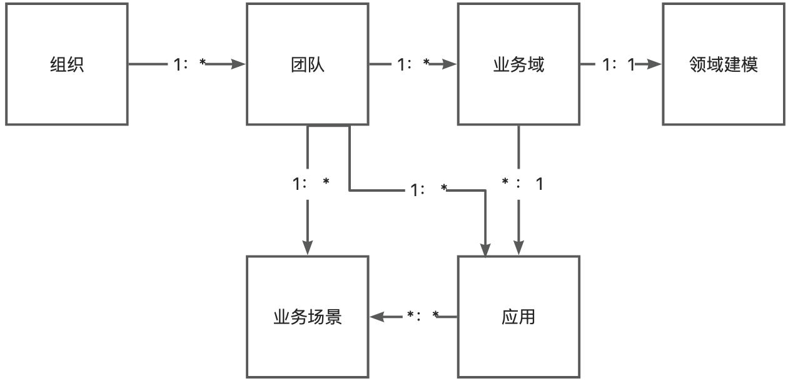
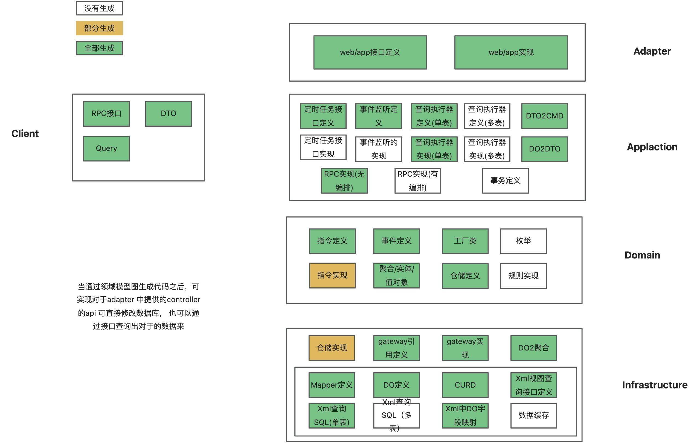
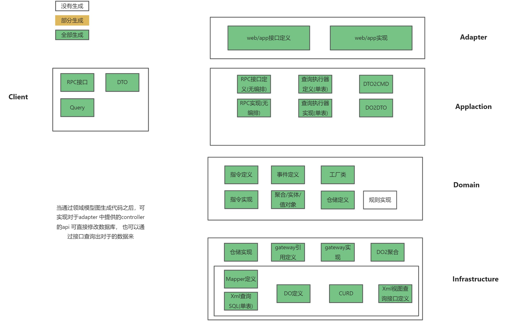
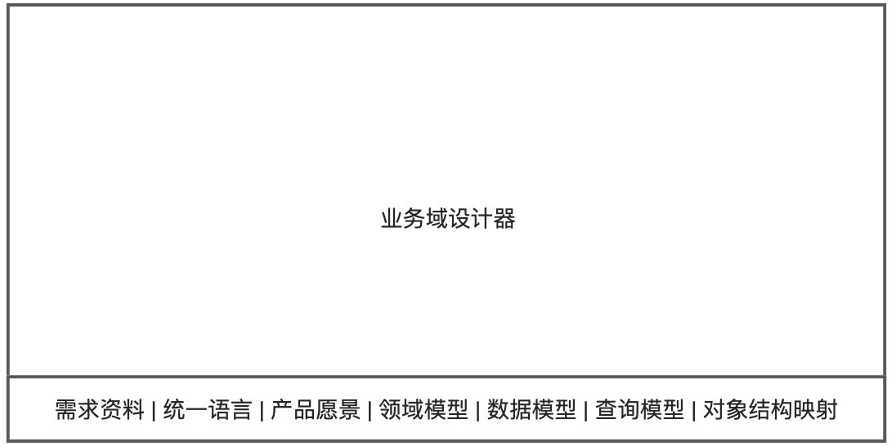

# 开发流程中的痛点

| **角色**  | **场景**      | **痛点**                                                      | **解决方案**                                                                                              |
|---------|-------------|-------------------------------------------------------------|-------------------------------------------------------------------------------------------------------|
| **架构师** | 新业务架构设计     | 1、不知道对产品的需求是否理解到位，2、不知道开发人员对与设计的执行是否到位                      | 1、通过统一语言，业务流程图，领域模型图跟产品一起事件风暴，确认每一个细节都覆盖道2、由于数据模型，领域模型可生成代码，架构师只需要关注模型的正确性即可                          |
| **产品**  | 需求评审、原型评审之后 | 1、技术与产品脱节，2、没法对开发实现过程进行纠正，只能在验收环节才能识别                       | 1、使用统一语言，业务流程图，领域模型图让产品和架构师，开发人员有了共同的语言2、模型图与代码保持双向同步，在编码发生了变化时，产品也能够通过领域模型图进行识别                      |
| **开发者** | 新需求定制开发     | 1、简单的并且重复性的工作多，既浪费时间又对自身提升没有帮助2、公司标准很多，不知如何落地3、不知道对需求理解是否到位 | 1、通过领域模型，数据模型生成整个代码框架，自带了公司的标准和编码规范。2、重复性的代码都通过代码生成器生成，开发人员只需要关注业务规则以及具体的技术细节即可3、通过领域模型图与产品，架构师随时达成共识 |
|         | 旧需求二次开发     | 1、产品资料分散2、需要从代码上进行反推业务逻辑，耗时耗力                               | 1、领域概览图包含了领域模型图，业务流程图，领域模型图，数据模型，以及与其他领域的依赖关系。2、代码与模型图同步                                              |

# 角色/场景

### 一、管理员

1. 创建`组织`
2. 创建`团队`
3. 成员、角色管理

### 二、产品经理

> 开发一个新的需求

1. 新增`业务域`
2. 录入`需求资料`，绘制`业务场景图`
3. 输入产品愿景、目标
4. 预先录入`统一语言`
5. 通知其他成员，基于业务流程图主线， 进行场景分析、领域建模设计

> 需求验收

1. 查看概览图（领域图、业务流程图） -> 应用概览，业务域概览
2. 验收 业务流程图

> 需求变更

1. ~~进行版本管理~~
2. 重走设计流程

### 三、架构师

> 开发一个新的需求

1. 查看`需求资料`、`产品愿景`、`统一语言`、`业务场景图`
2. 参与`领域建模`
3. 参与`数据建模`
4. 参与`服务设计`
5. 创建`应用`并关联`业务域`

> 设计验收

1. 查看`概览图`（应用概览、业务域概览...）
2. 对设计结果 review
3. 模型打分
4. 添加评论、建议

> 需求变更

1. 进行`版本管理`
2. 重走设计流程

### 四、开发者

> 开发新需求

1. 参与领域建模
2. 参与数据建模
3. 参与服务设计
4. 完成具体功能开发

> 需求变更

1. 参与设计

# 结构

- 组织： 组织可以对应租户、企业的概念，在组织下面可以挂靠多个团队。
- 团队：每个团队是单一职责的，通常负责独立子领域的开发工作。
- 业务域：可以理解为 DDD 中 ‘子域’ 的概念。也可以是**业务模块**，表示特定范围内的业务问题。在我们的开发平台中，一个业务域就是一个领域建模结果。
- 业务场景：主要表现形式就是一个`业务流程图`，用于表示特定业务场景下，各个角色的交互行为。
- 应用：应用可以理解为`微服务`、`限界上下文`之类的概念，这是程序运行、脚手架生成、代码同步的基本单位。**由多个业务域聚合而成
  **。

# DDD 研发流程

| 分类 | 研发流程          | 子流程    | 产物                                                                                                           | 描述                                                                                                                                                                                                            | 角色        |
|----|---------------|--------|--------------------------------------------------------------------------------------------------------------|---------------------------------------------------------------------------------------------------------------------------------------------------------------------------------------------------------------|-----------|
| 业务 | 需求分析          |        | 产品描述文档、原型、流程图，用户故事等等                                                                                         | 需求原始资料                                                                                                                                                                                                        | 产品        |
|    | 领域建模(战略、战术设计) | 产品愿景分析 | 产品愿景                                                                                                         | 产品的顶层价值设计。目的是在产品目标上达成一致[愿景分析规范示例](https://visual-ddd.yuque.com/tp6sfc/project_doc/qi5dxirh69r7rtm9#JNnz7)                                                                                                     | 产品+架构师+开发 |
|    |               | 场景分析   | 业务场景图，事件、动作、规则、主体、[统一语言](https://visual-ddd.yuque.com/tp6sfc/project_doc/qi5dxirh69r7rtm9#Dsflw)等            | 基于产品需求输入，以用户+场景/用例驱动，以[业务场景图](https://visual-ddd.yuque.com/tp6sfc/project_doc/qi5dxirh69r7rtm9#s5vBQ)``为主线，识别出各种事件、动作、规则和主体[场景分析规范示例](https://visual-ddd.yuque.com/tp6sfc/project_doc/qi5dxirh69r7rtm9#S8IUu) |           |
|    |               | 领域建模   | 事件、命令、规则、实体、值对象、聚合、聚合根、限界上下文、[统一语言](https://visual-ddd.yuque.com/tp6sfc/project_doc/qi5dxirh69r7rtm9#Dsflw)等 | 在场景分析的输出结果之上，识别出事件、命令、实体、值对象等基础对象；找根据依存关系找出聚合根、聚合。最后将聚合根进一步分离限界上下文 如：[领域模型规范示例](https://visual-ddd.yuque.com/tp6sfc/project_doc/qi5dxirh69r7rtm9#LdBQH)                                                       |           |
|    |               | 战术设计   | 更完备的对象模型，服务对象                                                                                                | 在领域建模的基础上，对模型进行详细设计：[领域模型规范示例](https://visual-ddd.yuque.com/tp6sfc/project_doc/qi5dxirh69r7rtm9#LdBQH)- 细化实体、值对象的属性和行为、关系- 服务设计：领域服务、应用服务                                                                     |           |
| 技术 | 详细设计          | 模型设计   | ER 图                                                                                                         | 在领域模型的基础上设计数据存储方案 [ER图示例](https://visual-ddd.yuque.com/tp6sfc/project_doc/qi5dxirh69r7rtm9#T1RsZ)                                                                                                             | 架构师+开发    |
|    |               | 接口设计   | RPC、HTTP API、事件、事件监听等                                                                                        | 在领域模型的基础上，设计对外交互的各种形式                                                                                                                                                                                         |           |
|    |               | 应用聚合   | 自动汇总对象、服务、统一语言等 ，生成上下文映射                                                                                     | 将业务域(建模结果)关联到应用。应用通常可以理解为一个限界上下文、或者微服务。 将`业务场景`关联到应用。- 应用会自动汇总所有`业务域`下的对象、服务、统一语言 - 可以`业务场景图`上编辑`业务域关联` - 自动生成`上下文映射图`[应用概览图示例](https://visual-ddd.yuque.com/tp6sfc/project_doc/qi5dxirh69r7rtm9#WxxJc)       |           |
|    | 技术评审          | 技术评审   | [评分标准](http://www.wakedata.net/pages/viewpage.action?pageId=27696169)                                        | 对领域模型、数据模型、接口等进行评审                                                                                                                                                                                            | 架构师，产品    |
|    | 代码开发          | 代码生成   |                                                                                                              | 脚手架的生成、代码双向同步都是以应用为单位的                                                                                                                                                                                        | 开发        |
|    | 质量检测          | 代码审核   |                                                                                                              | code review模型图与代码的自动校验（CI）                                                                                                                                                                                    |           |

# 代码

# 简单逻辑的生成效果

# 原型概览

建模设计器

- 需求资料： 原始需求资料
- 产品愿景：描述业务域的目标用户、核心价值、差异化竞争点
- 统一语言：业务域统一语言
- 领域模型：领域模型图
- 数据模型：ER 图
- 查询模型：查询接口设计
- 对象结构映射：创建领域模型、数据模型与结构对象之间的相互映射关系

# 术语

- **结构化对象**： 一般指的是没有行为的、纯粹的数据对象，比如 DTO DO。
- **结构化对象命名规范**: 结构化对象的命名有多种规范，在惟客会使用以下规范：
    - DTO
    - DO

#  

