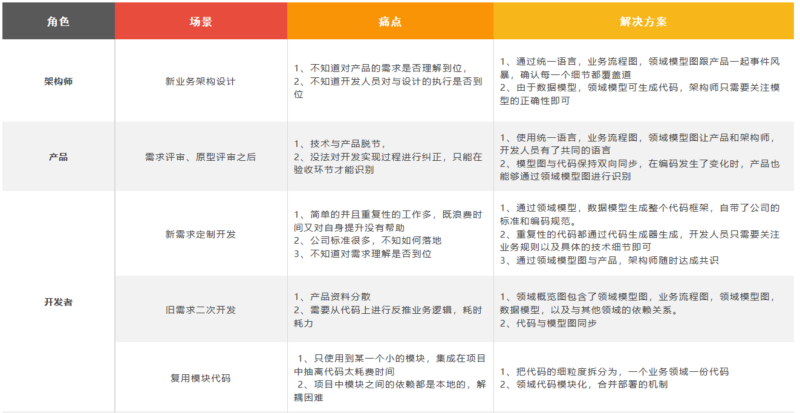

# 快速入门概述

本文指引企业不同角色的人员使用 DDD可视化开发平台。

为快速了解如何使用 DDD可视化开发平台 进行云原生应用建设，您可以通过示例项目和参考帮助文档进行实验，了解业务场景分析，架构设计、DDD编码，AI辅助拜尼马主要过程。关于示例项目的内容，请参见 [示例项目简介](./示例项目/示例项目简介.md)和[示例项目的使用限制说明](./示例项目/示例项目限制说明.md)等。

- 如果您是系统管理员，需要添加账号、团队管理，为企业成员授权，请参见 [平台和项目管理](../操作指南/平台和项目管理/团队应用管理/业务场景管理.md)。

- 如果您是业务专家/产品人员，需要进行以下操作：

  - 业务场景分析， 请参见：  [示例：业务场景建模](../操作指南/业务建模平台/业务场景建模.md)
  - 构建统一语言 ，请参见：  [示例：统一语言](../操作指南/平台和项目管理/团队应用管理/统一语言.md)
  - 场景过程分析， 请参见：  [示例：模型设计](../操作指南/业务建模平台.md)。

- 如果您是架构师，作为架构设计的核心人员您需要以下操作

  - 从0到1设计建模，请参见  [示例：模型设计](https://help.aliyun.com/zh/bizworks/getting-started/example-design-a-model)。
  - 建设一个完整的中心应用，请参见  [示例：开发中心应用](../操作指南/平台和项目管理/团队应用管理/应用管理.md)。
  - 组织设计文档的评审  

- 如果您是开发人员，需要以下操作

  - 参与设计建模  [示例：模型设计](https://help.aliyun.com/zh/bizworks/getting-started/example-design-a-model)。
  - 参与评审
  - 文档转换成代码 [插件示例：代码生成](../操作指南/应用开发平台/IDEA插件集成.md)
  - AI 辅助编码 

