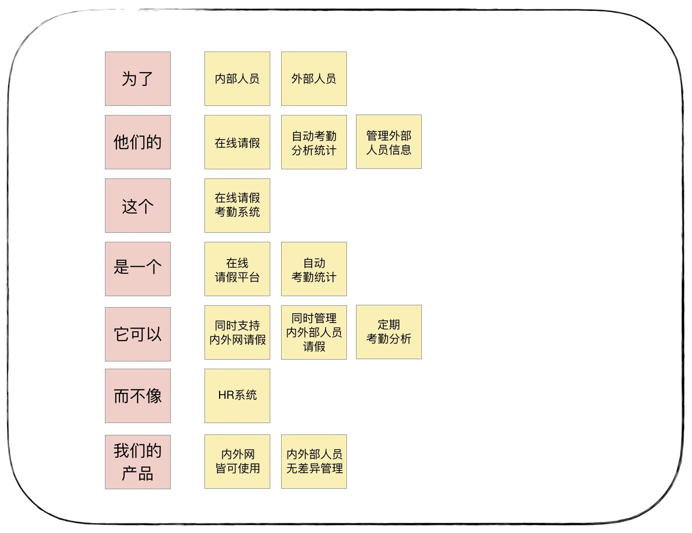
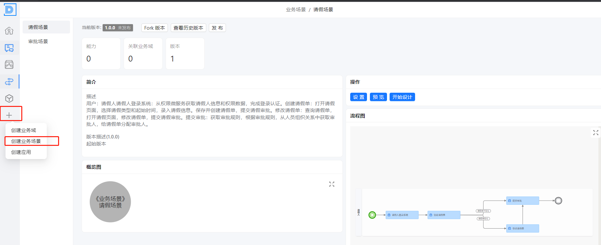
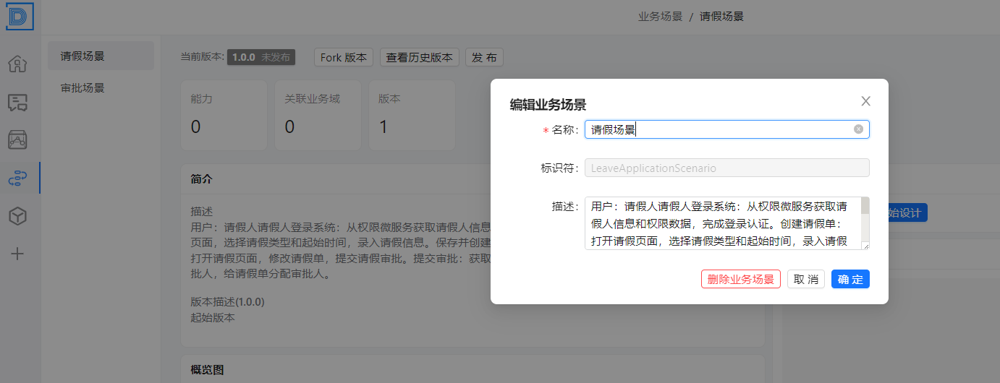
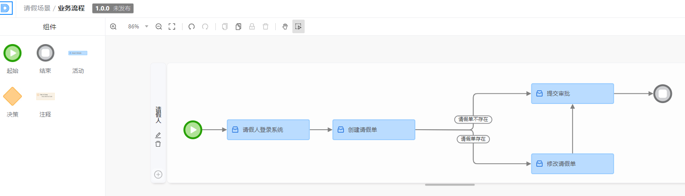
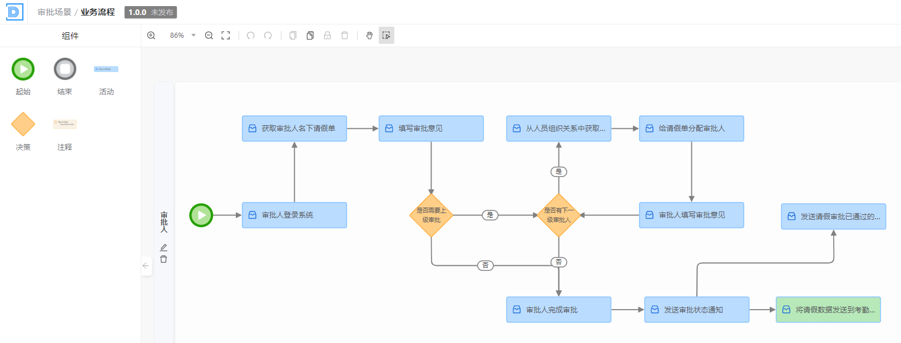

# 业务场景分析

本文介绍通过理解和定义业务问题。目标是识别关键的业务需求和约束，以及确定软件解决方案应如何帮助业务达成其目标，为达成这个目标，需要的操作流程，以及各角色之间的协同关系

## 操作步骤

- 与业务专家合作，理解业务目标和挑战。

- 确定关键业务流程和操作。

- 收集和分析业务规则、术语和数据。

## 与业务专家合作，理解业务目标和挑战

**产品愿景**：是对产品顶层价值设计，对产品目标用户、核心价值、差异化竞争点等信息达成一致，避免产品偏离方向

基于以上的规则，请假系统的产品愿景为：

​       为了满足内外部人员，他们的在线请假、自动考勤统计和外部人员管理的需求，我们建设这个在线请假考勤系统，它是一个在线请假平台，可以自动考勤统计。它可以同时支持内外网请假，同时管理内外部人员请假和定期考勤分析，而不像 HR 系统，只管理内部人员，且只能内网使用。我们的产品内外网皆可使用，可实现内外部人员无差异管理

## 确定关键业务流程和操作

### 第一个场景：请假

**用户**：请假人

**请假人登录系统**：从权限微服务获取请假人信息和权限数据，完成登录认证。

**创建请假单**：打开请假页面，选择请假类型和起始时间，录入请假信息。保存并创建请假单，提交请假审批。

**修改请假单**：查询请假单，打开请假页面，修改请假单，提交请假审批。

**提交审批**：获取审批规则，根据审批规则，从人员组织关系中获取审批人，给请假单分配审批人。

### 第二个场景：审批

**用户**：审批人

**审批人登录系统**：从权限微服务获取审批人信息和权限数据，完成登录认证。

**获取请假单**：获取审批人名下请假单，选择请假单。

**审批**：填写审批意见。

**逐级审批**：如果还需要上级审批，根据审批规则，从人员组织关系中获取审批人，给请假单分配审批人。重复以上 4 步。

最后审批人完成审批。

在DDD 可视化平台中的操作步骤为：

### 1. 创建业务场景

-  填写业务场景的关键信息
  - 名称： 场景名称
  - 标识符： 业务场景的唯一标识符，可作用代码中
  - 描述： 描述场景的核心目标，流程，以及规则

 

### 2 业务场景的设计

- 起始
  - 场景的开始节点
- 结束
  - 场景都结束节点
- 活动
  - 关键活动节点的抽象
- 决策
  - 决策点，可以分为很多个分支
- 注释
  - 对某一个节点的注释

#### 请假的业务场景：

#### 审批的业务场景：

## 收集和分析业务规则、术语和数据

收集请假类型（比如病假、年假、事假等）、审批规则和企业政策。 构建统一语言

