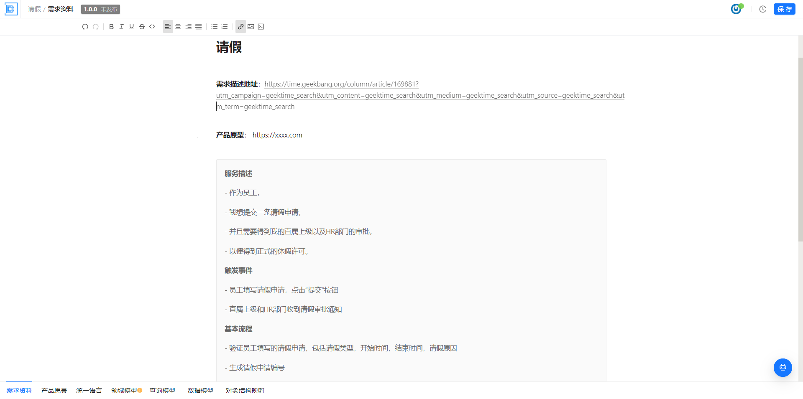
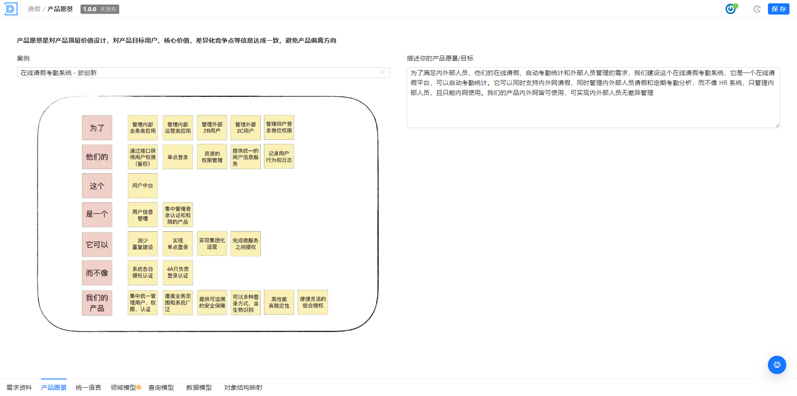
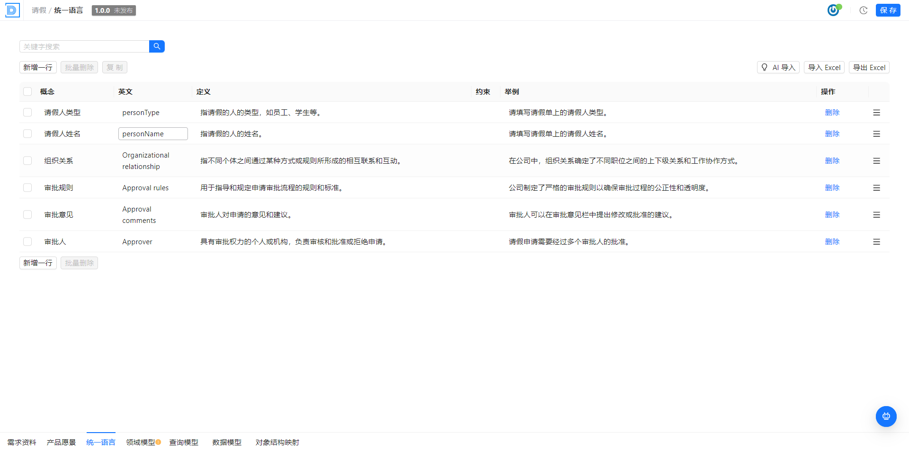
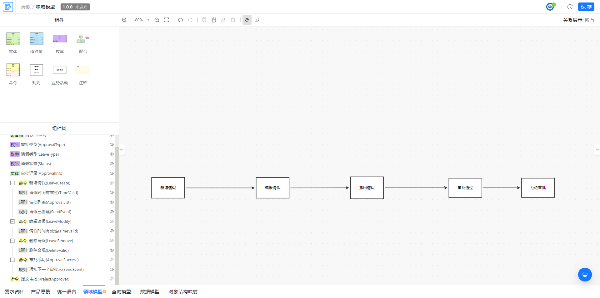
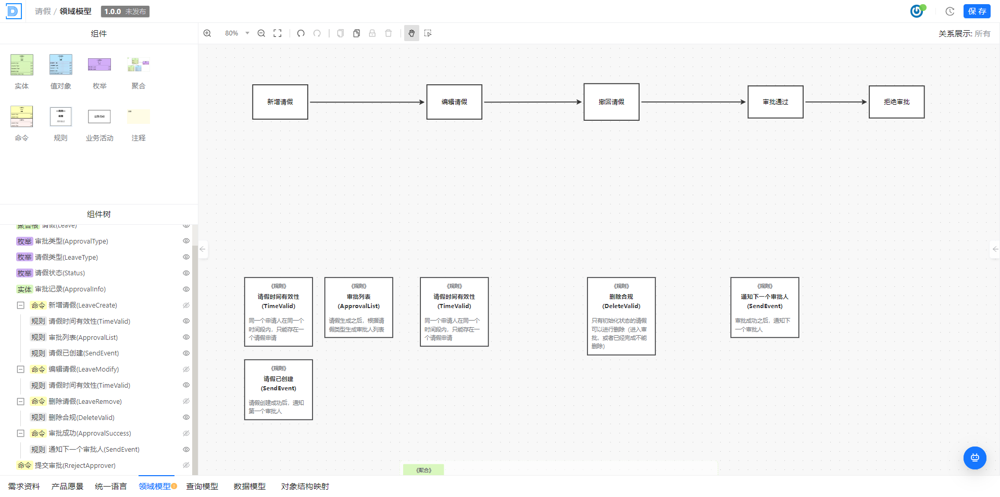
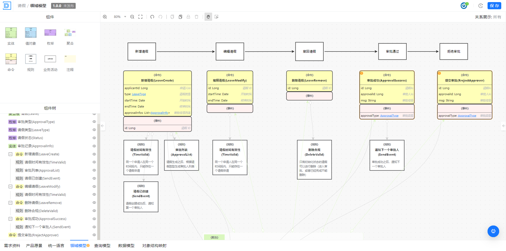
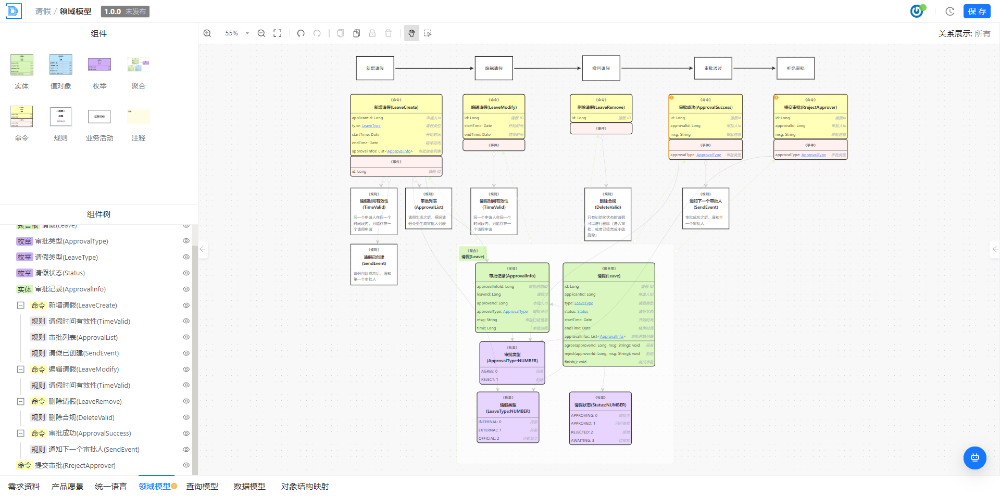
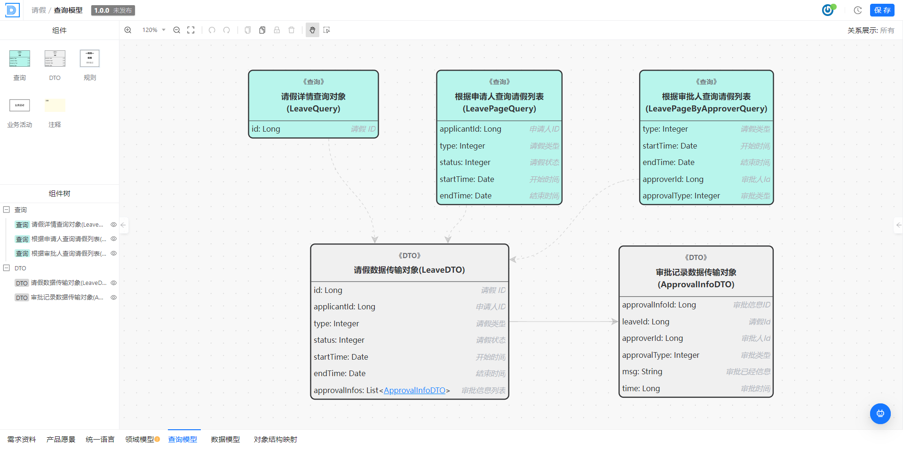
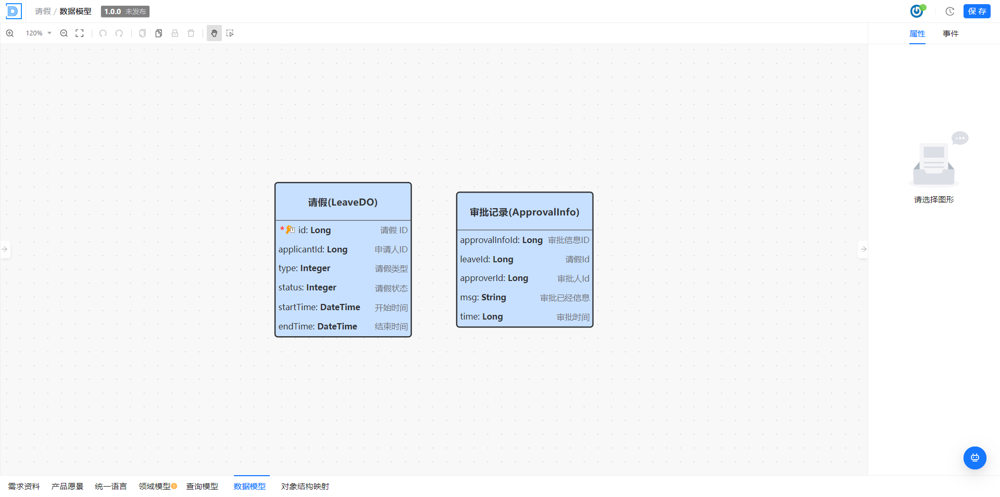
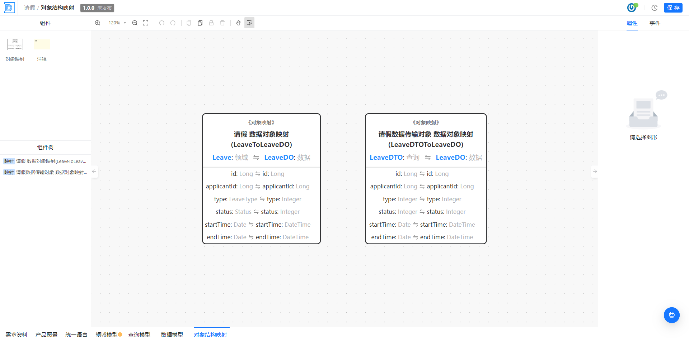

# 领域建模

本文描述系统架构师创建反映业务领域的概念模型，与领域专家合作以确保模型准确反映业务实体和关系，如何构建领域模型，对具体的业务场景进行架构设计

## 操作步骤

- 需求资料分析与记录
- 产品愿景
- 统一语言
- 领域模型
- 查询模型 
- 数据模型
- 对象结构映射

## 需求资料分析与记录

> 描述：收集、整理、记录用户需求和系统功能需求的文档，它对于软件开发过程起着指导、衡量和验证作用，以及软件设计的思路，解决方案等信息

详情请参见：[需求资料](../../操作指南/业务建模平台/业务域建模/需求文档.md)

具体信息的记录，按实际情况而定， 如请假系统中，记录了请假的用户故事的用例分析

## 产品愿景

> 描述：产品愿景是对于产品发展方向和目标的总体概述，它阐述了产品应该是什么、为什么存在、为谁服务、带来什么价值。

## 统一语言

> 描述：为了协调团队成员（包括开发人员、客户、领域专家等）对于业务领域的理解而共同制定的该领域内的术语和表达方式；

## 领域模型

> 描述：为了协调团队成员（包括开发人员、测试、领域专家等）对于业务领域的理解而共同制定的该领域内的模型； 它描述了当前业务领域提供哪些业务原子能力；

详细步骤如：

- 分析场景过程的全生命周期流程， 列出关键节点，作为命令的方式显示（抽象能力接口）
- 对每一个关键节点进行分析，分析规则以及约束点
- 基于以上的规则和约束， 推断出 需要输入的参数，作为命令的参数
- 推断需要实现以上的规则和约束，需要什么样的数据结构和服务
- 设计承载以上数据结构的聚合根
- 拆分实体和值对象，枚举

### 分析场景过程的全生命周期流程， 列出关键节点，作为命令的方式显示（抽象能力接口）

### 对每一个关键节点进行分析，分析规则以及约束点

### 基于以上的规则和约束， 推断出 需要输入的参数，作为命令的参数

### 推断需要实现以上的规则和约束，需要什么样的数据结构和服务

### 设计承载以上数据结构的聚合根

### 拆分实体和值对象，枚举

## 查询模型 

> 描述：描述当前业务领域下包含的查询原子能力，对应一个查询器；

查询器，可应用于，对外接口的展示，UI 的显示等

## 数据模型

> 描述：数据模型即数据存储模型，是数据的最终存储结构；提高系统的数据质量、性能和可维护性；

## 对象结构映射

> 描述：描述当前业务领域下实体对象之间的字段映射关系；对应代码中的Convert转换器；

 

