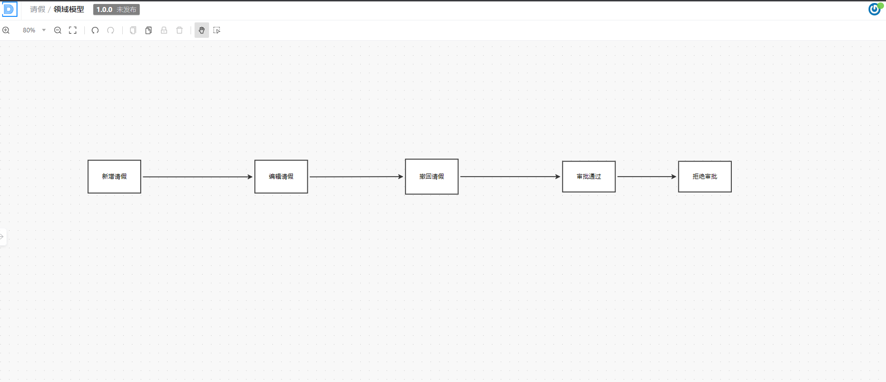
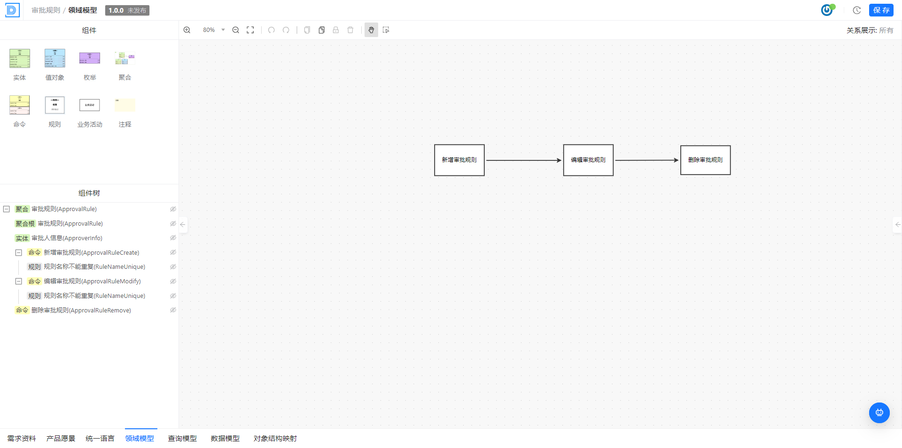
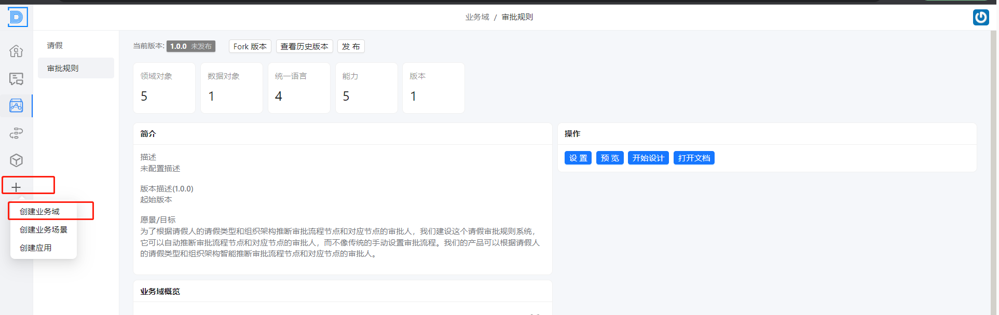
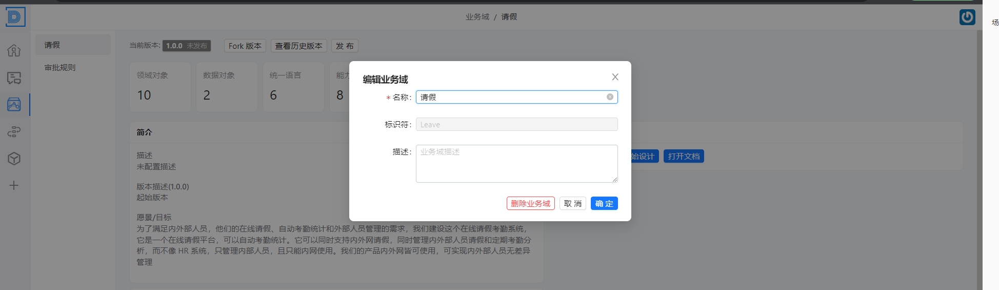

# 场景过程分析

本文介绍，作为产品和架构师深入入分析特定的业务场景和流程，以便更好地了解业务操作的具体细节。通过这种方式，可以识别出关键业务流程，以便于拆分关键的业务模块 。

## 操作步骤

- 描述业务流程的详细步骤。
- 识别和分析业务流程中的决策点。
- 映射流程中的数据流和信息交换。
- 评估流程中的异常情况和潜在风险。

## 描述业务流程的详细步骤

- 描述员工提交请假申请到审批结束的整个流程。

## 识别和分析业务流程中的决策点

分析审批流程中的决策点，如直接主管审批、高级审批、自动审批等。

- 需要根据审批规则进行构建，以此推断出需要构建一个审批规则的流程

  

## 映射流程中的数据流和信息交换

映射数据流，如申请信息从员工到经理，再到人事部门

## 评估流程中的异常情况和潜在风险

 考虑异常情况，比如申请撤回、审批拒绝、审批超时等

### 根据请假的过程分析， 来进行业务模块的拆分， 以此得出两个模块

- 请假模块

- 审批规则模块

### 创建业务域

- 选择业务域进行创建

- 填充业务域的信息

