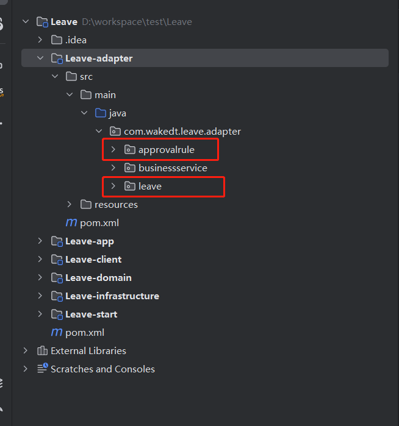
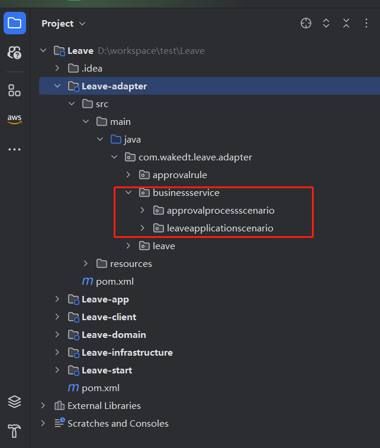
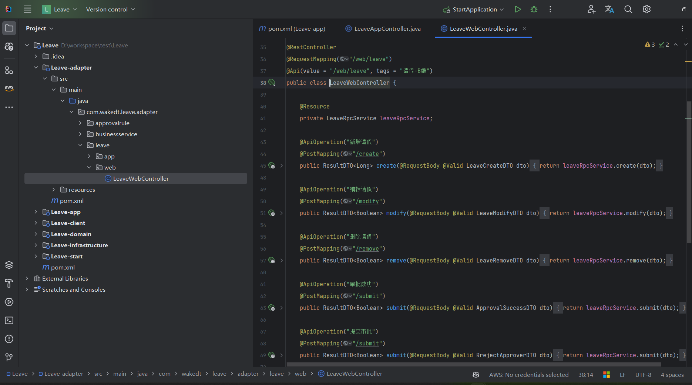
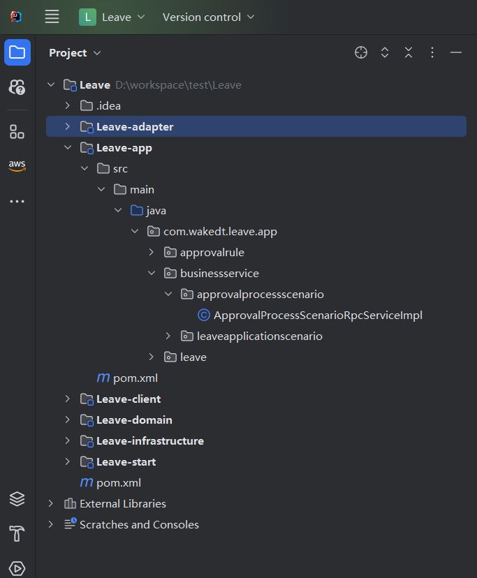
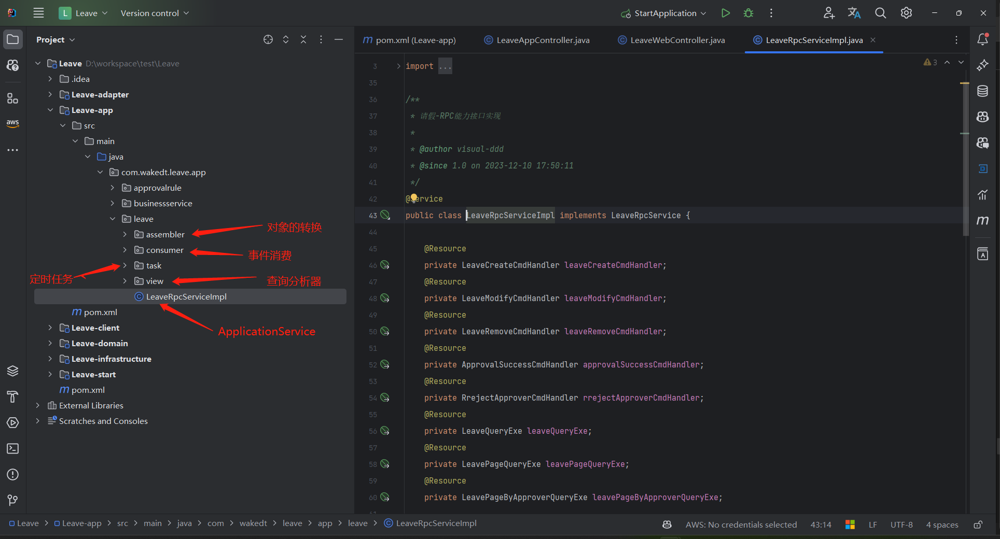
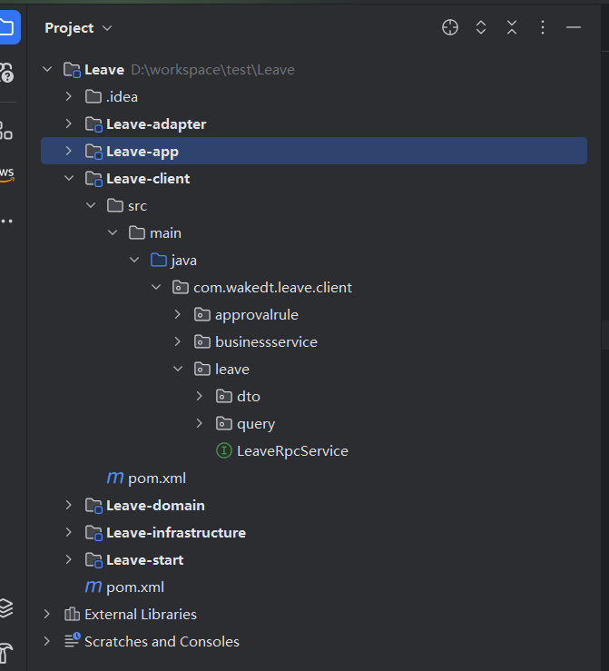
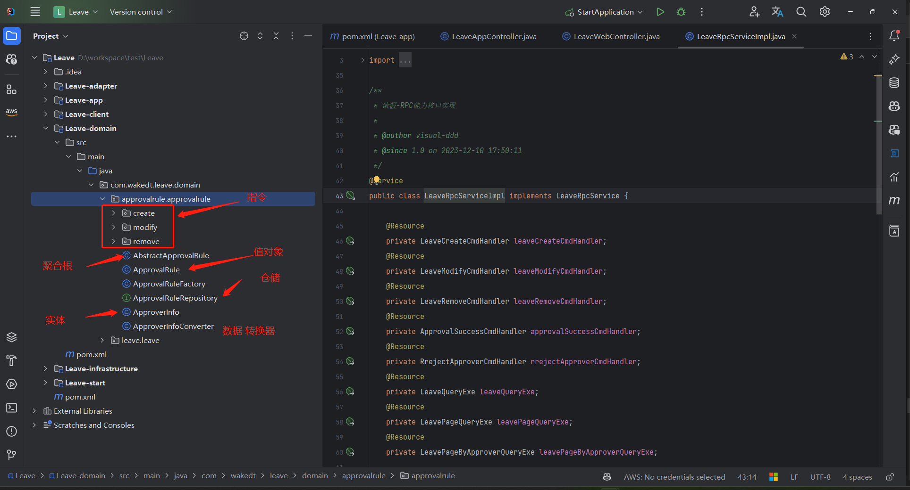
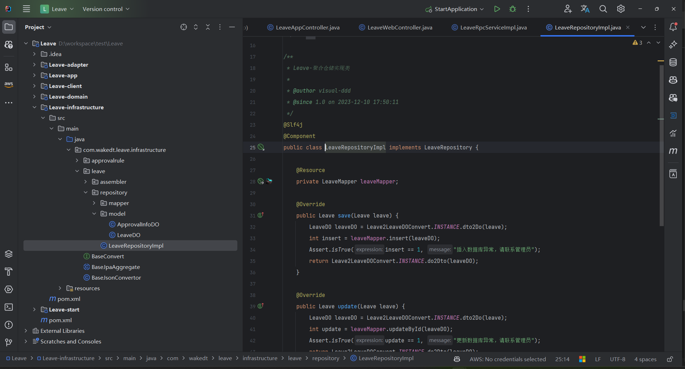

# 模型即代码

本文描述如何通过模型转换成为代码，直接生成即可运行，可以直接与前端进行联调，只要直接部署到开发环境即可。

## 操作步骤

- 使用idea插件生成代码
- 代码的结构
- swagger 测试

### 使用idea插件生成代码

- 具体请参见 [IDIA插件集成](../../操作指南/应用开发平台/IDEA插件集成.md)

### 代码的架构

- cola 架构

- adapter 

  - 按业务域进行分包

  - 按业务场景进行分包
  - 存在的`api`接口

  **按业务域进行分包**

  - 请假
  - 审批规则

  

  **按业务场景进行分包**

  - 请假场景
  - 审批场景

  

  **标注化代码生成**

  

- app 

  - 业务场景的应用服务

  

  - 业务与的应用服务

    

- client 

- domain 

- infrastructure

### swagger 测试

运行即显示swagger 地址进行测试。可直接链接数据库