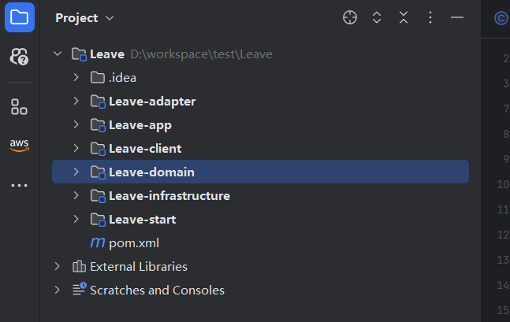

# 模型即代码

本文描述如何通过模型转换成为代码，直接生成即可运行，可以直接与前端进行联调，只要直接部署到开发环境即可。

## 操作步骤

- 使用idea插件生成代码
- 代码的结构
- swagger 测试

## 使用idea插件生成代码

- 具体请参见 [IDIA插件集成](../../操作指南/应用开发平台/IDEA插件集成.md)

## 代码的架构

- cola 架构

  

- **adapter** 
  - 按业务域进行分包

  - 按业务场景进行分包
  - controller的`api`接口

> 适配层（Adapter Layer）：负责对前端展示（web，wireless，wap）的路由和适配，对于传统B/S系统而言，adapter就相当于MVC中的controller；

  

**按业务域进行分包**

  - 请假
  - 审批规则

  

  **按业务场景进行分包**

  - 请假场景
  - 审批场景

  

  **controller的`api`接口** 

> controller标准化代码生成

  

- **app** 

  - 业务场景的应用服务
  - 业务域的应用服务

  > 应用层（Application Layer）：主要负责获取输入，组装上下文，参数校验，调用领域层做业务处理，如果需要的话，发送消息通知等。层次是开放的，应用层也可以绕过领域层，直接访问基础实施层

  **业务场景的应用服务**

  

  **业务域的应用服务**

  

- **client** 

  > Client模块（Client Module）：包含的代码应该是常见的服务接口Facade和DTO数据传输对象，如API、DTO、领域事件、Command和Query对象等等

- **domain** 

  > 领域层（Domain Layer）：主要是封装了核心业务逻辑，并通过领域服务（Domain Service）和领域对象（Domain Entity）的方法对App层提供业务实体和业务逻辑计算。领域是应用的核心，不依赖任何其他层次；

- **infrastructure**

  > 基础实施层（Infrastructure Layer）：主要负责技术细节问题的处理，比如数据库的CRUD、搜索引擎、文件系统、分布式服务的RPC等。此外，领域防腐的重任也落在这里，外部依赖需要通过gateway的转义处理，才能被上面的App层和Domain层使用。

## swagger 测试

运行即显示swagger 地址进行测试。可直接链接数据库