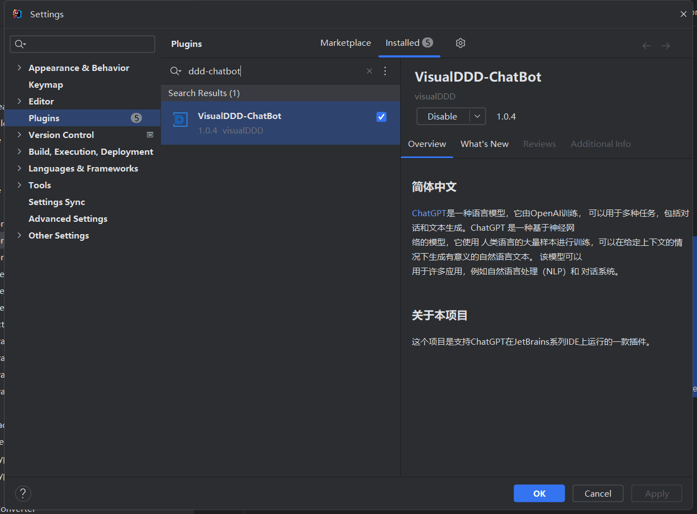
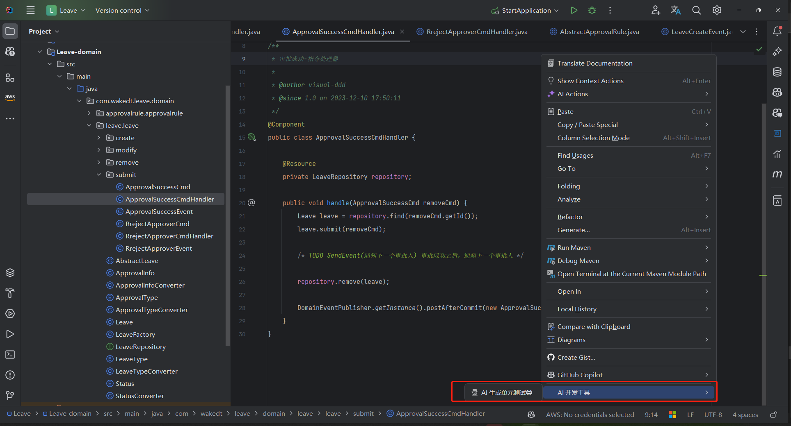
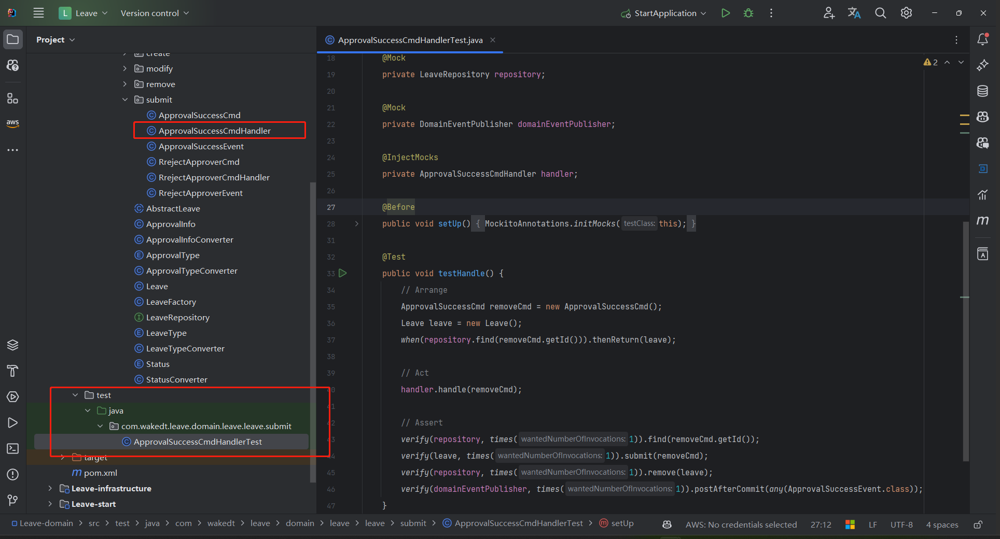
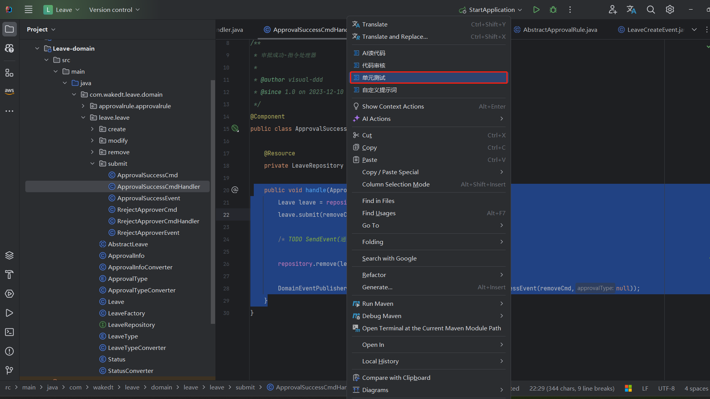
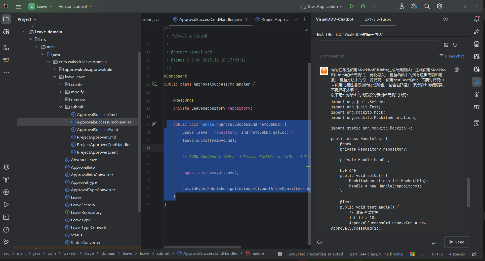
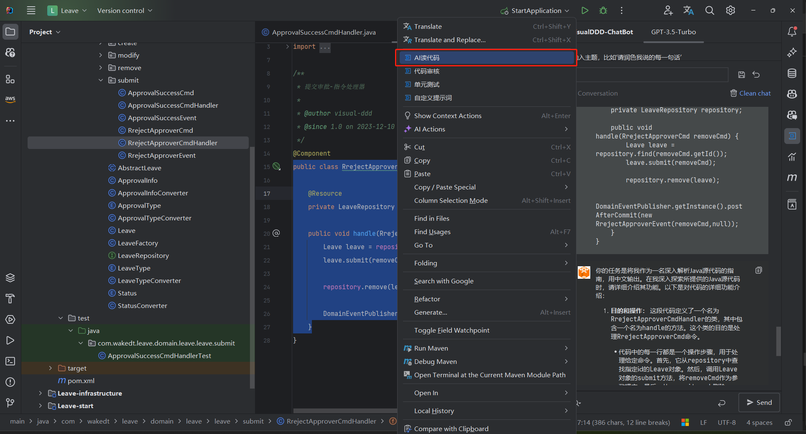
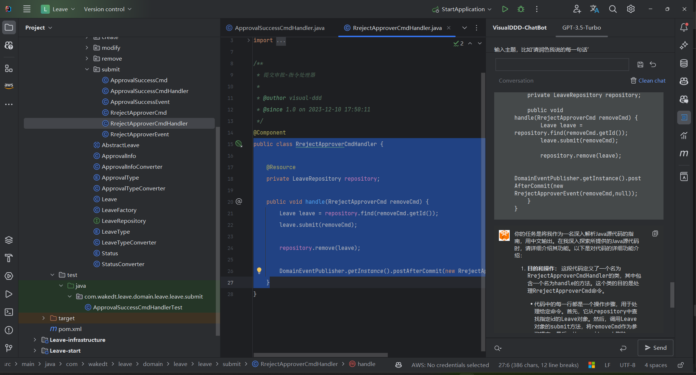
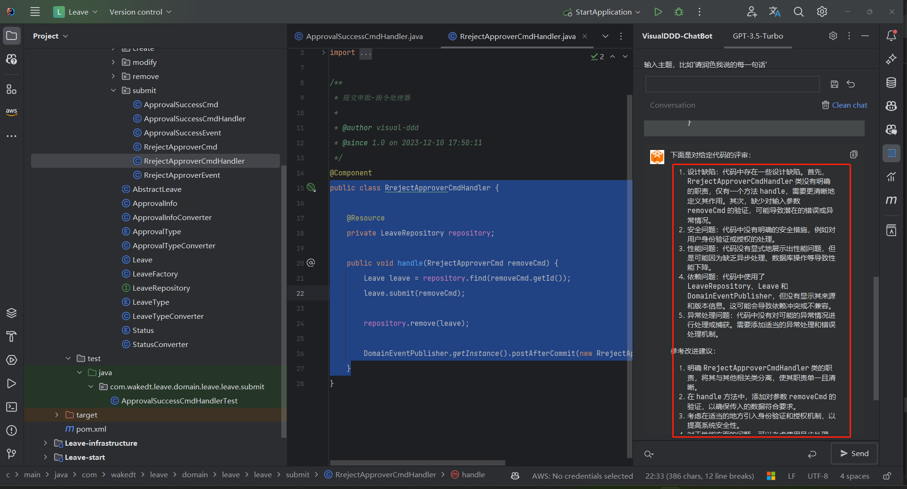
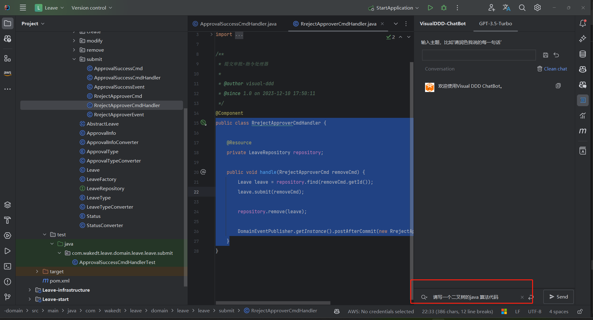

# AI辅助编码

本文介绍，在使用  `模型即代码` 生成结构性代码之后，在基于此通过AI辅助编码， 让开发人员具有更高的效率和质量

## 操作步骤

- 下载chatbot 插件
- 生成单元测试
- AI 读代码
- AI 代码审核
- chatbot 的应用

### 下载chatbot 插件

- 在插件市场寻找到插件

### 生成单元测试

- 方式一： 选择要生成的单元测试的类，右键：

  
  -   ·生成结果：

​      

- 选中代码-右键单元测试，则生成指定代码的单元测试

  

  - 生成的结果

​      

### AI 读代码

> 经常应用与对源代码的阅读，对复杂代码阅读

- 启动，右键选择要读的代码

  

- 输出结果

  

### AI 代码审核

### chatbot 的应用

- 算法，以及规则性代码

  

