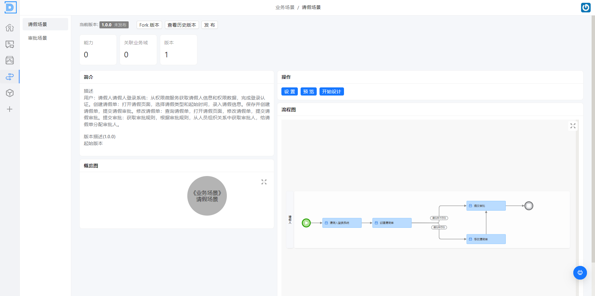
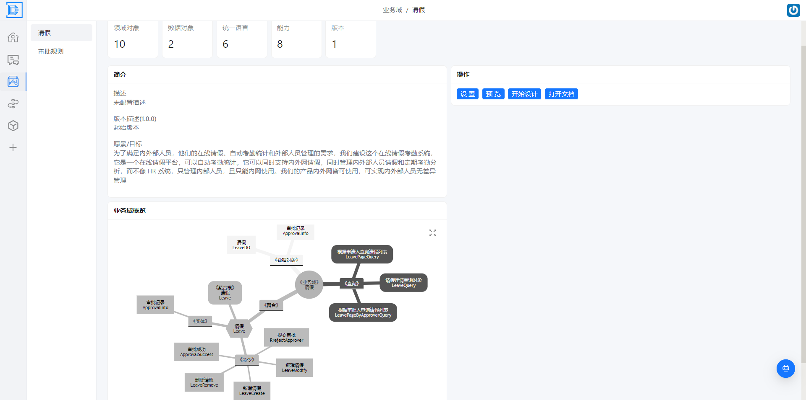
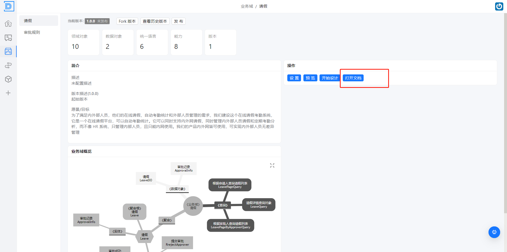
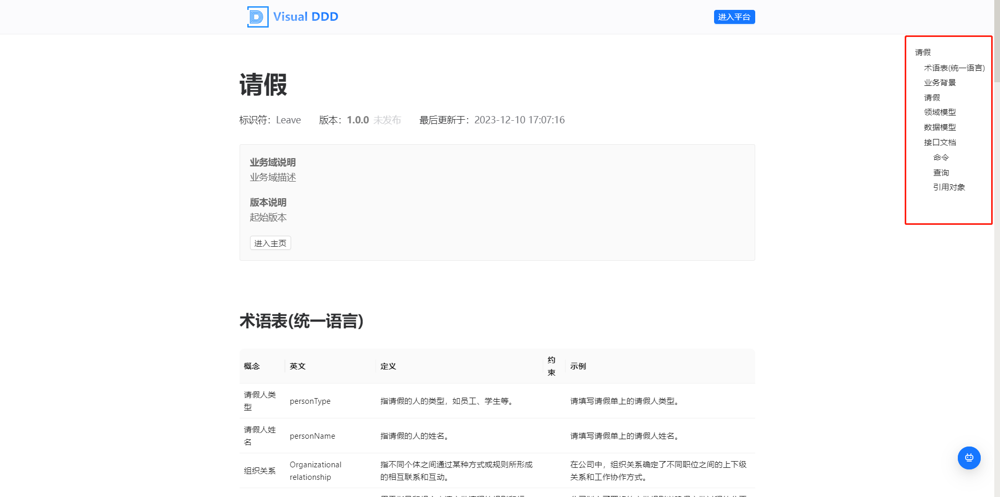
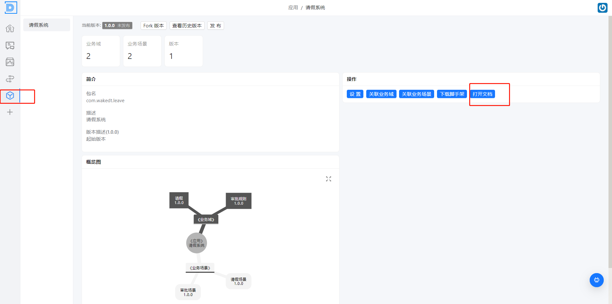
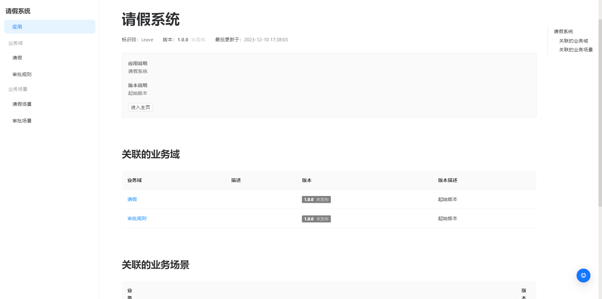

# 设计评审与校验

本文描述 在领域模型设计完成之后，在项目的概关键角色人员对，设计的进行回顾评审与校验，以便于确认大家都对需求，设计都达成一致

## 操作步骤

- 业务场景的文档评审
- 领域模型文档的评审

- 业务域设计文档的评审
- 应用的文档评审

### 业务场景的文档评审

> 在业务场景层面达成一致， 关联人员： 业务，产品， 架构师， 开发人员， 测试

- 概览图
  -  表示与内部系统，与外部系统的链接
- 流程图
  - 表示内部业务节点与角色之间的协同关系

### 领域模型文档的评审

>  包含了，查询模型， 数据模型， 聚合 之间的关系的检查与补充- 

- 识别有多少个领域对象， 以及领域对象之间的关系

  

### 业务域设计文档的评审

> 包含了，对这个业务模块的整体的设计思路，目标愿景， 模型图，接口 等的评审

- 打开文档

  

* 文档明细

### 应用的文档评审

> 应用文档是针对于多个业务文档和业务场景文档的集合，一个应用一般等于一个限界上下文

文档明细

