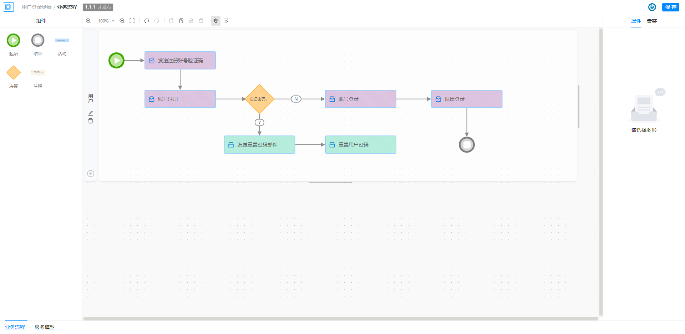
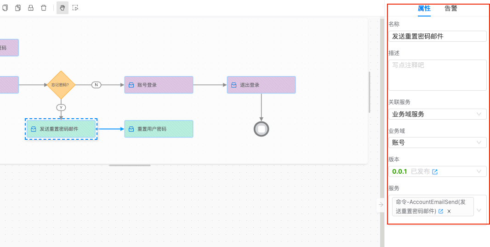

# 业务流程图

> 描述：业务流程图是一种图形化的表示方式，用于描述和展示业务流程的各个步骤、活动和决策点，
> 以及它们之间的关联和顺序。通过使用符号和箭头来表示不同的活动和流程之间的流转关系，
> 业务流程图可以帮助人们更好地理解和分析业务流程，从而提高业务流程的效率和质量。

（1）拖出左侧组件，绘制业务流程图

（2）点击活动节点，关联服务实现的接口

可关联的选项如下：

业务场景服务：对应[业务场景-服务模型](./服务模型.md)中设计的 服务接口；

业务域服务：对应业务域中的命令和查询接口；

外部服务：外部服务接口依赖，用来补充描述外部接口引入；

