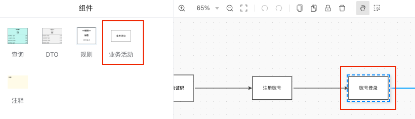
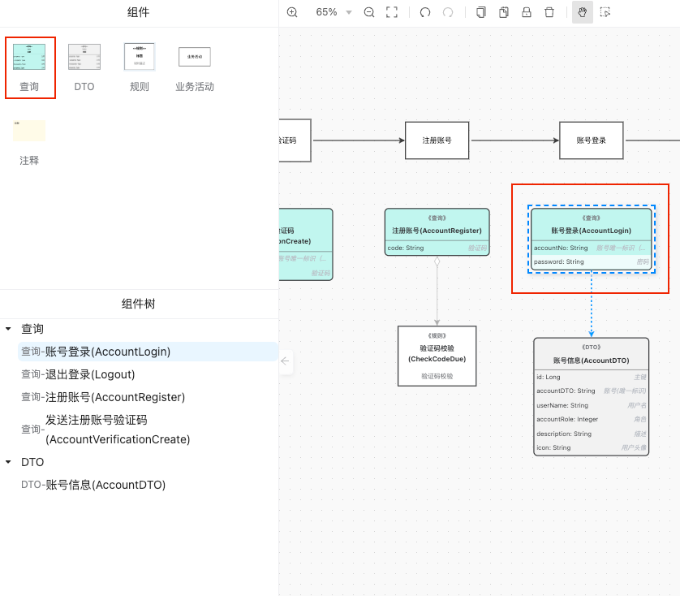
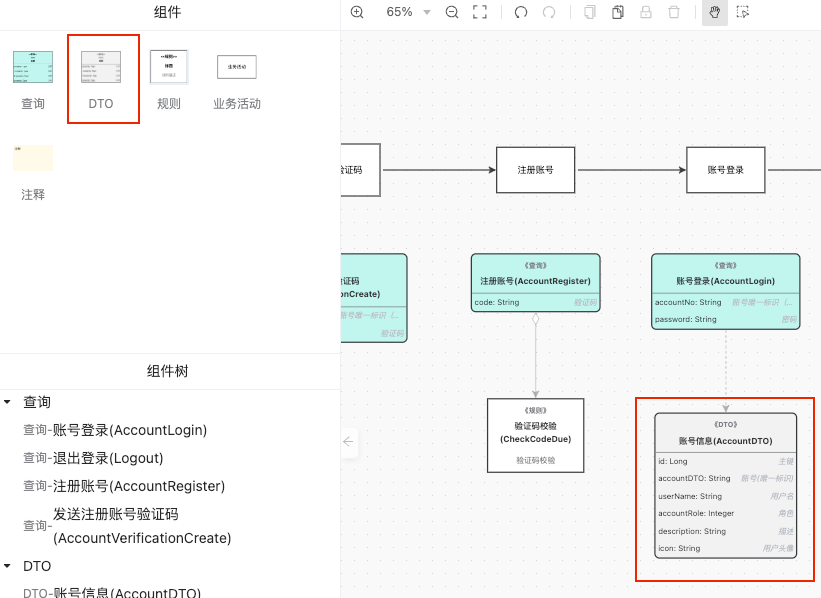
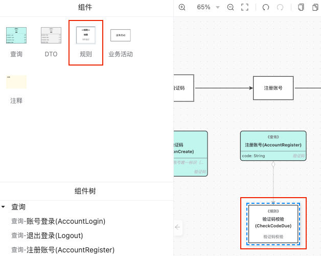

# 服务模型

> 描述：在DDD可视化平台中，服务模型是通过可视化工具来设计和定义系统中的服务及其之间的关系和交互，
> 以提高开发效率和支持领域驱动设计。

作用：
1. 定义业务逻辑和规则。
2. 解耦复杂性，拆分系统为独立的服务模型。
3. 支持领域驱动设计，结合领域模型和业务逻辑。
4. 提高开发效率，通过可视化界面定义和配置服务模型。

（1）拖出“业务活动”组件，创建一个活动描述，例如：账号登录

（2）拖出“查询”组件，对应接口的请求对象（对象名称、入参），填写相应的信息

| 配置项 | 说明        | 约束    | 举例         |
|-----|-----------|-------|------------|
| 标题  | 中文简称      |       | 账号信息       |
| 标识符 | 英文名，以驼峰命名 | 标识符唯一 | AccountDTO |
| 描述  | 描述信息      |       |            |
| 属性  | 对应接口的出参列表 |       | userName   |

(3)拖出“DTO”组件，对应接口的返回值对象（返回对象名称、出参），填写相应的信息

| 配置项 | 说明        | 约束         | 举例                    |
|-----|-----------|------------|-----------------------|
| 标题  | 中文简称      |            | 验证码校验                 |
| 标识符 | 英文名，以驼峰命名 | 标识符唯一      | CheckCodeDue          |
| 描述  | 描述信息      |            | 校验验证码是否正确             |
| 关联  | 需要关联的接口对象 | 只能关联一个接口对象 | 关联AccountRegister接口对象 |

（4）拖出“规则”组件，描述业务活动包含的规则，填写信息

| 配置项   | 说明        | 约束          | 举例                   |
|-------|-----------|-------------|----------------------|
| 名称    | 中文简称      |             | DDD可视化开发平台           |
| 标识符   | 英文名，以驼峰命名 | 团队的应用中标识符唯一 | WdVisualDDD          |
| 起始版本号 | 第一个版本号    | 符合语义化版本的标准  | 0.0.1、0.0.1-SNAPSHOT |
| 描述    | 描述信息      |             | DDD可视化开发平台           |