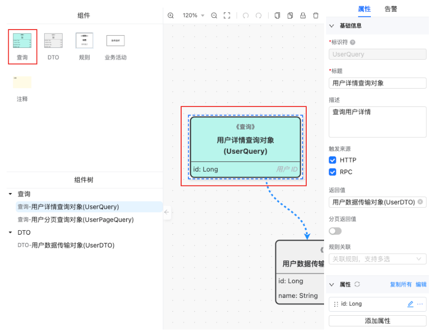
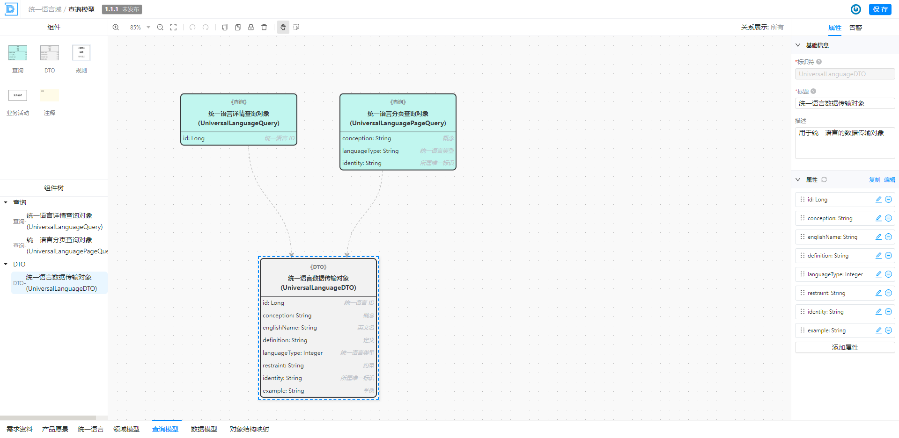

# 查询模型

> 描述：描述当前业务领域下包含的查询原子能力，对应一个查询器；

3.4.5.1 查询条件
> 描述：查询条件对象，即请求对象；用于描述单个查询请求的入参；

| 配置项   | 说明         | 约束            | 举例            |
|-------|------------|---------------|---------------|
| 标题    | 中文简称       |               | 用户详情查询对象      |
| 标识符   | 英文名，以驼峰命名  | 标识符唯一         | AccountLogin  |
| 描述    | 描述信息       |               | 查询用户详情        |
| 触发来源  | 当前接口由谁触发执行 | HTTP、RPC      | HTTP、RPC      |
| 返回值   | 接口的返回类型    | 基本数据类型、自定义DTO | 引用自定义的UserDTO |
| 分页返回值 | 是否为分页查询接口  | 是/否           | 开启标识当前为分页查询   |
| 规则关联  | 接口包含的业务规则  | 支持多选          | 关联自定义的规则      |
| 属性    | 对应接口的入参列表  |               | id            |

3.4.5.1 查询返回值

> 描述：查询结果返回对象，供查询条件的返回值引用；用于描述单个查询请求的出参；

