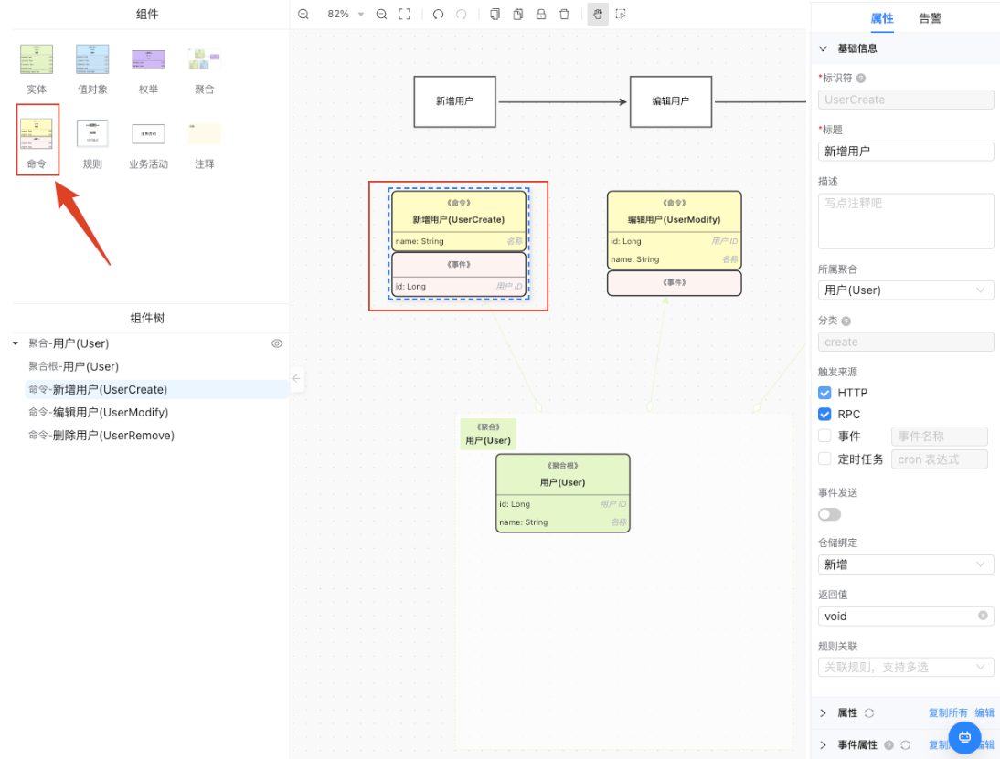
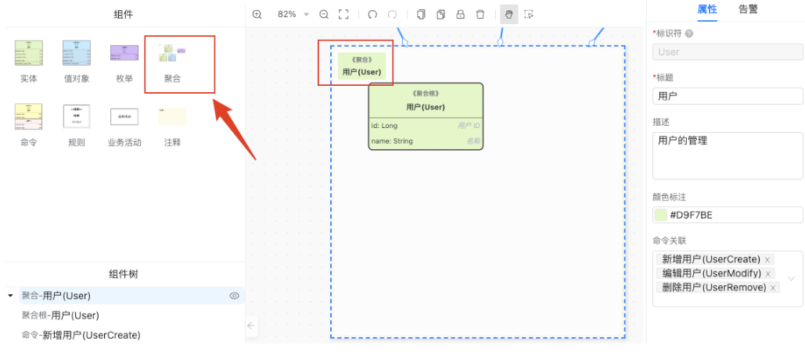
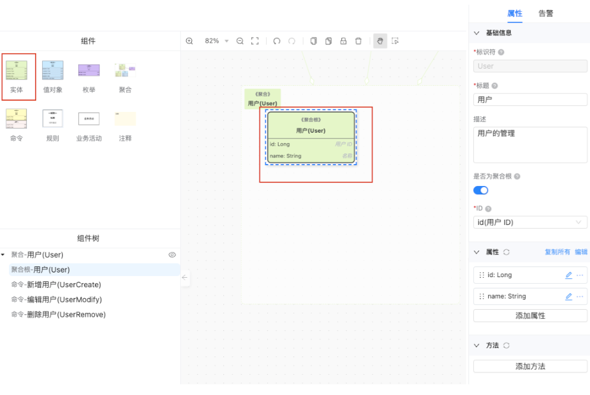
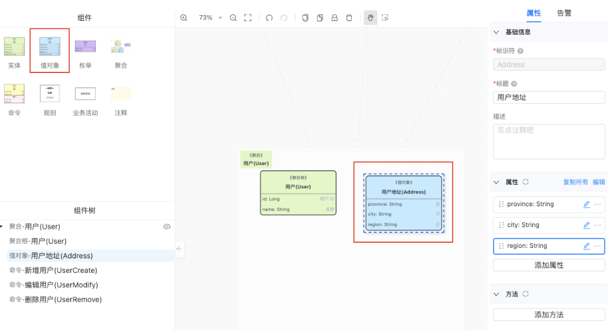
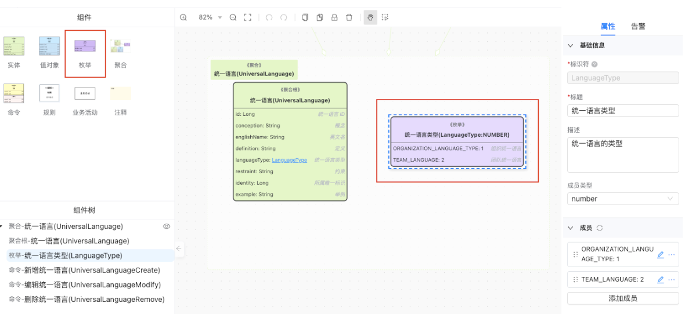

# 领域模型

> 描述：为了协调团队成员（包括开发人员、测试、领域专家等）对于业务领域的理解而共同制定的该领域内的模型；
> 它描述了当前业务领域提供哪些业务原子能力；

3.4.4.1 命令

> 描述：当前业务域下提供的原子操作（增删改）；

3.4.4.2 聚合

> 描述：聚合是领域驱动设计中的一个重要设计原则，其内部具有清晰的关联关系和行为，有利于业务实现和领域模型的理解和设计，同时也有助于实现数据的一致性和完整性。

3.4.4.3 实体 & 聚合根

> 描述：

实体(Entity)指具有唯一身份的对象或概念；

聚合根(Aggregate Root)是一种特殊类型的实体，它是聚合内部其他实体的入口点和入口操作；

3.4.4.4 值对象

> 描述：值对象是一种表示不可变的、没有身份标识并且具有值语义的对象。与实体(Entity)不同，值对象不需要唯一标识符，它的价值在于它的属性，而不是它的标识符。

3.4.4.5 枚举

> 描述：枚举类型表示具有固定数量的值的数据类型，其中的每个值都代表了一种特定的状态。

