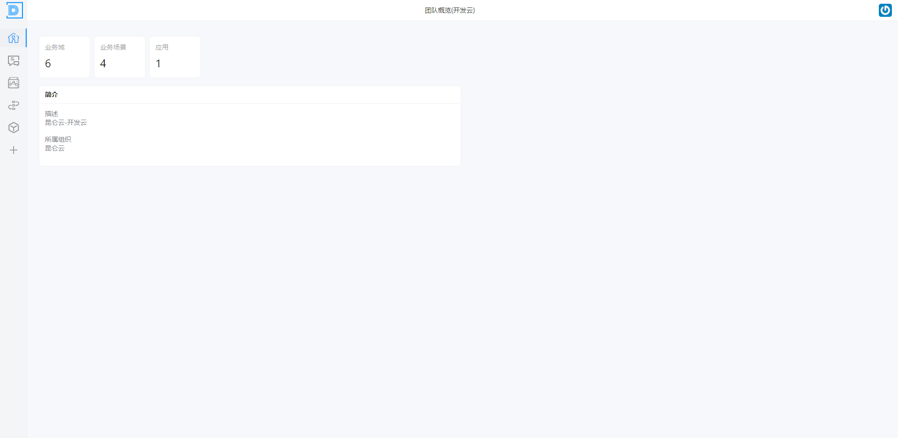

# 团队应用管理

> 描述：提供从需求设计到代码开发的功能支持

## 3.1 团队概览

> 描述：展示团队的概览信息，包含业务域、业务场景、应用等信息

 

## 3.2 [统一语言](团队应用管理/统一语言.md)

> 描述：负责管理和维护组织和团队的统一语言；通过查看统一语言快速了解组织和团队的专业术语（统一语言）
> 需要注意的是，组织统一语言是组织内共享的，团队统一语言是团队内共享的

## 3.3 [业务场景管理](团队应用管理/业务场景管理.md)

> 描述：负责业务场景的管理及版本的维护

## 3.4 [业务域管理](团队应用管理/业务域管理.md)

> 描述：负责业务域的管理及版本的维护