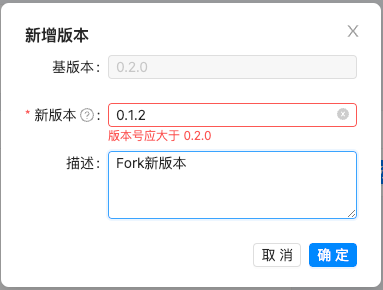

# 业务场景管理

> 描述：负责业务场景的管理及版本的维护

## 3.5.1 业务场景创建

（1）点击“创建业务场景”按钮

 

（2）填写业务场景的基本信息，点击确定；

 

## 3.5.2 业务场景编辑

（1）点击“设置”按钮

 

（2）编辑业务场景信息

> 约束：标识符不能修改

 

## 3.5.3 业务场景删除

暂不支持删除业务场景

## 3.5.4 业务场景概览

> 描述：用于展示业务场景的简介及概览图等信息

 

## 3.5.5 业务场景版本创建（Fork）

（1）点击“Fork版本”按钮

 

（2）填写新版本信息

> 约束：新版本号必须大于旧版本

 

## 3.5.6 业务场景版本跳转

（1）点击“查看历史版本”按钮

 

（2）点击“跳转”按钮，即可跳转到对应版本界面

 

## 3.5.7 业务场景版本删除

为核心数据，暂不支持版本删除功能

## 3.5.8 业务场景版本发布

（1）点击“发布”按钮

 

（2）填写发布信息，点击确定

 

（3）查看版本状态为“已发布”

 