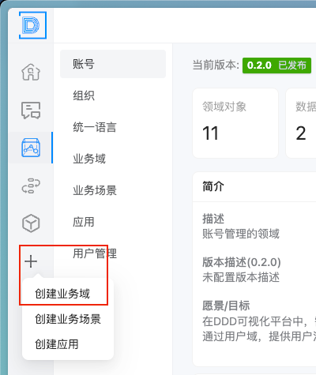
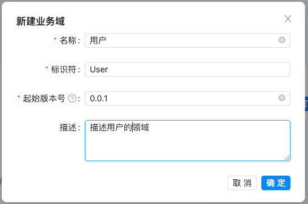
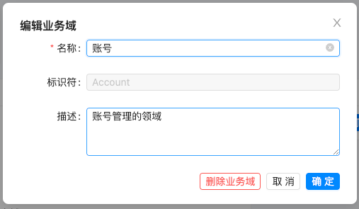
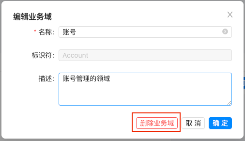
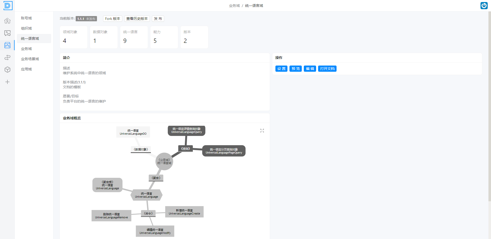
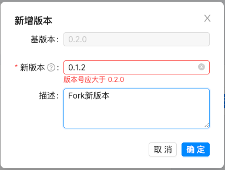

# 业务域管理

> 描述：负责业务域的管理及版本的维护；

## 3.3.1 业务域创建

（1）点击“创建业务域”按钮

 

（2）填写业务域的基本信息，点击确定；

 

## 3.3.2 业务域编辑

标识符不能修改

 

## 3.3.3 业务域删除

暂不支持删除业务域

 

## 3.3.4 业务域概览

> 描述：用于展示业务域的简介及概览图等信息

 

## 3.3.5 业务域版本创建（Fork）

（1）点击“Fork版本”按钮

 
（2）填写新版本信息

约束：新版本号必须大于旧版本

 

## 3.3.6 业务域版本跳转

（1）点击“查看历史版本”按钮

 

（2）点击“跳转”按钮，即可跳转到对应版本界面

## 3.3.7 业务域版本删除

为核心数据，暂不支持版本删除功能

## 3.3.8 业务域版本发布

（1）点击“发布”按钮

 

（2）填写发布信息，点击确定

 

（3）查看版本状态为“已发布”

 