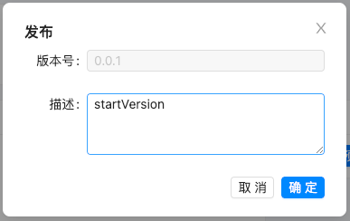

# 应用管理

> 描述：负责应用的管理及版本的维护

## 3.7.1 应用创建

（1）点击“创建应用”按钮

（2）填写应用的基本信息，点击确定；

| 配置项   | 说明        | 约束          | 举例                   |
|-------|-----------|-------------|----------------------|
| 名称    | 中文简称      |             | DDD可视化开发平台           |
| 标识符   | 英文名，以驼峰命名 | 团队的应用中标识符唯一 | WdVisualDDD          |
| 起始版本号 | 第一个版本号    | 符合语义化版本的标准  | 0.0.1、0.0.1-SNAPSHOT |
| 描述    | 描述信息      |             | DDD可视化开发平台           |

## 3.7.2 应用编辑

（1）点击“设置”按钮

（2）编辑应用信息，点击确定

约束：标识符不能修改

## 3.7.3 应用删除

暂不支持删除应用

## 3.7.4 应用概览

> 描述：用于展示应用的简介及概览图等信息

## 3.7.5 应用版本创建（Fork）

（1）点击“Fork版本”按钮

（2）填写新版本信息

约束：新版本号必须大于旧版本

## 3.7.6 应用版本跳转

（1）点击“查看历史版本”按钮

（2）点击“跳转”按钮，即可跳转到对应版本界面

## 3.7.7 应用版本删除

为核心数据，暂不支持版本删除功能

## 3.7.8 关联业务域

（1）点击“关联业务域”按钮

（2）选择需要关联的业务域版本

## 3.7.8 关联业务场景

（1）点击“关联业务域”按钮

（2）选择需要关联的业务域版本

## 3.7.9应用版本发布

约束：需要先发布关联的业务域和业务场景

（1）点击“发布”按钮

（2）填写发布信息，点击确定

（3）查看版本状态为“已发布”

