# 统一语言

> 描述：负责管理和维护组织和团队的统一语言；通过查看统一语言快速了解组织和团队的专业术语（统一语言） 
> 需要注意的是，组织统一语言是组织内共享的，团队统一语言是团队内共享的。

### 3.2.1 统一语言新增

点击“新增一行”按钮，新增一条统一语言

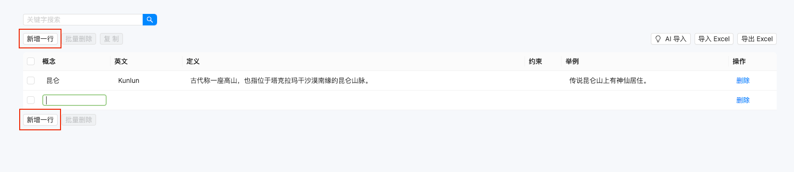 

### 3.2.2 统一语言更新

选中需要编辑的统一语言，更新对应的内容

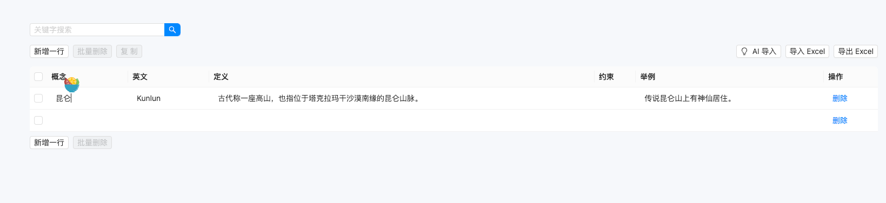 

### 3.2.3 统一语言删除

（1）点击统一语言管理模块，选择要删除的统一语言；

（2）在统一语言详情中点击“删除”按钮，系统会弹出确认框进行二次确认；

（3）点击确认后，该组织将被标记为删除状态并移除统一语言列表。

需要注意的是，在进行统一语言删除操作时，需要进行二次确认，以防止误删；统一语言删除成功后，将无法恢复已删除的统一语言信息，请谨慎操作。

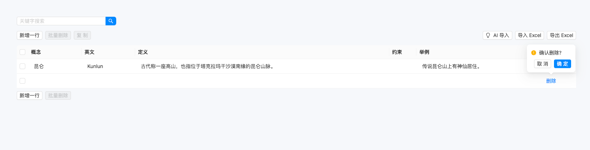 

### 3.2.4 统一语言搜索

（1）在查询页面中输入关键词，例如“昆仑”；

（2）点击“查询”按钮，系统将返回与输入关键词匹配的统一语言列表，用户可以选择查看所需统一语言信息。

需要注意的是，在进行统一语言查询操作时，可以使用关键词搜索来缩减查询的范围，便于快速查找所需统一语言信息。

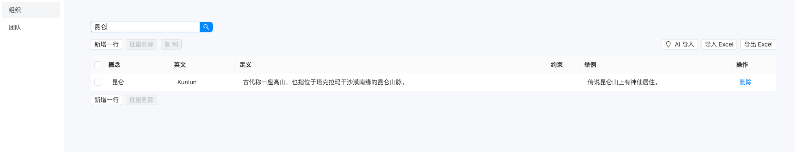 

### 3.2.5 统一语言导入Excel

（1）点击“导入Excel”按钮

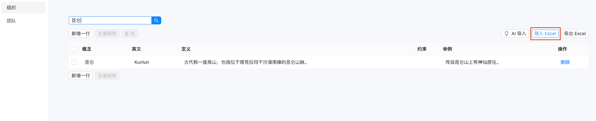 
（2）点击“下载模版”按钮，下载统一语言导入模版文件并编辑

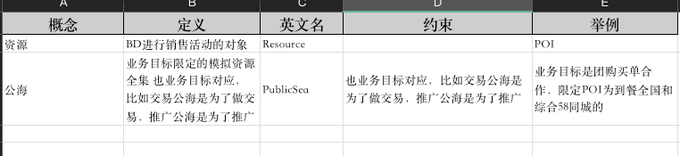 
（3）将需要导入的Excel文件拖入对话框中

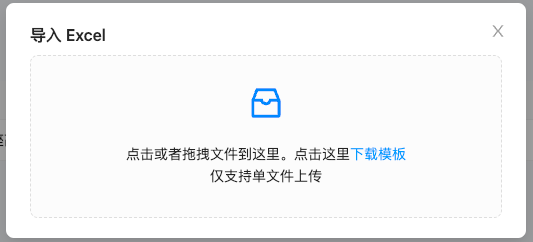 

### 3.2.6 统一语言导出Excel

（1）点击“导出Excel”按钮

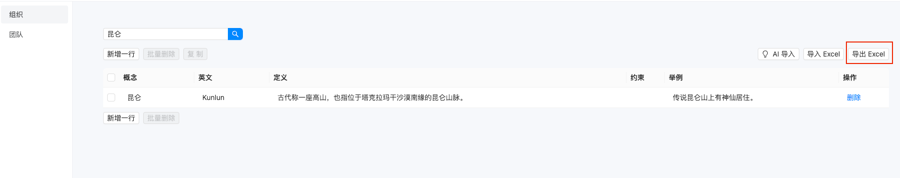 
（2）下载Excel文件

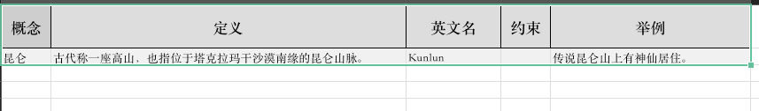 

### 3.2.7 AI 导入统一语言（辅助）

> 描述：通过AI快速提取文本中的统一语言，并生成对应的英文名、描述等信息

（1）点击“AI导入”按钮

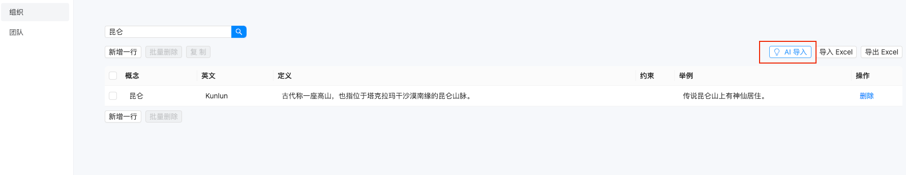 
（2）在文本框中粘贴需要分析的文本，点击“开始分析”按钮

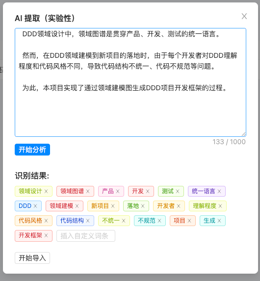 
（3）对分析的结果进行筛选后，点击“开始导入”按钮

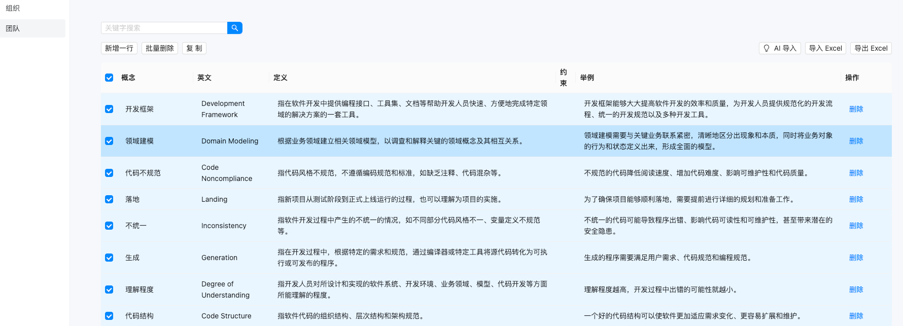 
