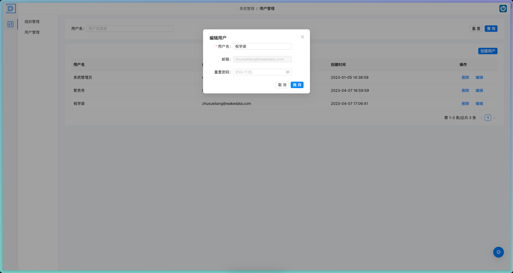
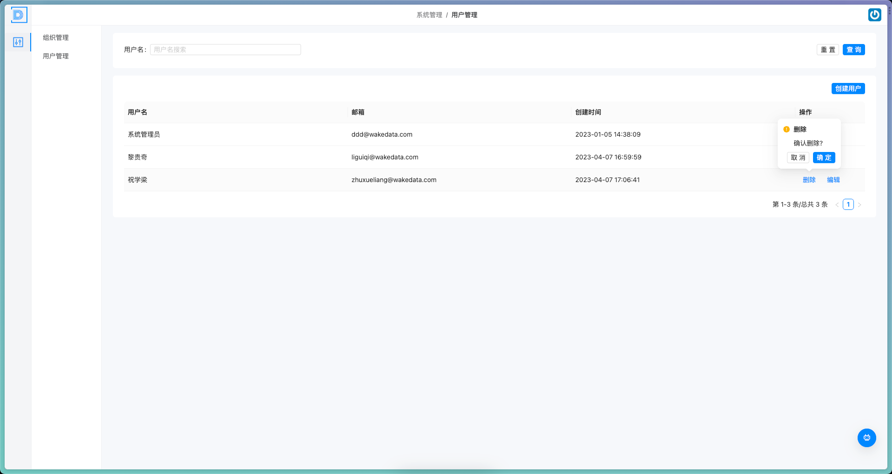
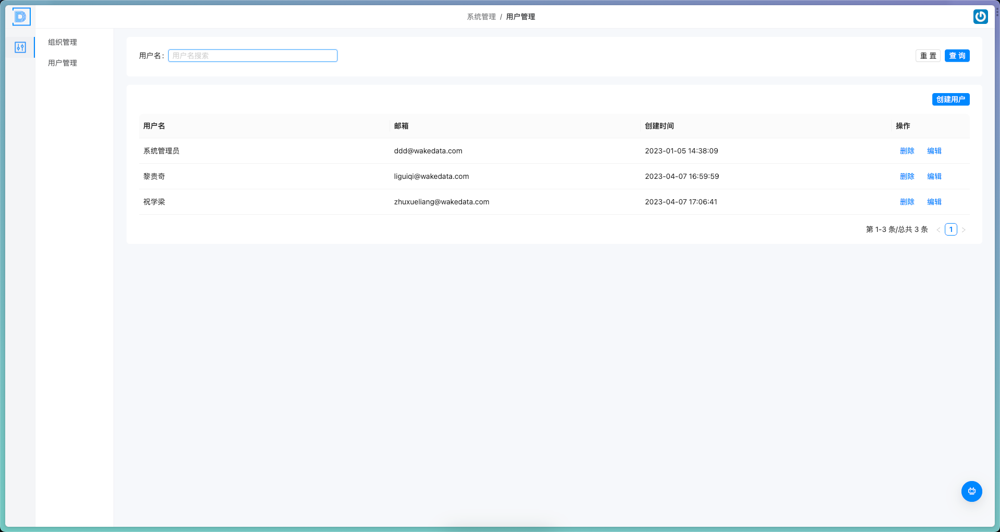

# 用户管理

> 描述：对系统的用户信息进行管理和维护

### 1.2.1 用户创建

（1）进入用户管理模块，选择“添加用户”功能；

（2）在弹出的页面中填入用户相关信息，如用户姓名、密码、邮箱等；

（3）点击“保存”按钮，系统将自动创建该用户并分配唯一的用户ID。

需要注意的是，在进行用户创建操作时，必要的信息不能为空，而且用户账号和密码需要真实有效；系统分配的唯一用户ID便于后续的用户管理。

 

### 1.2.2 用户更新

（1）进入用户管理模块，选择要编辑的用户；

（2）在用户详情页面中点击“编辑”按钮，进入编辑页面；

（3）在各栏中更新用户相关信息，如用户姓名、密码、邮箱等；

（4）完成修改后，点击“保存”按钮，用户信息更新成功并返回用户详情页。

 

### 1.2.3 用户删除

（1）进入用户管理模块，选择要删除的用户；

（2）在用户详情页面中点击“删除”按钮，系统会弹出确认框进行二次确认；

（3）点击确认后，该用户将被标记为删除状态并移除用户列表。

需要注意的是，在进行用户删除操作时，需要进行二次确认，以防止误删；用户删除成功后，将无法恢复已删除的用户信息，请谨慎操作。

 

### 1.2.4 用户查询

（1）点击用户管理模块，选择“查询用户”功能；

（2）在弹出的查询页面中输入关键词，例如“张三”；

（3）点击“查询”按钮，系统将返回与输入关键词匹配的用户列表，用户可以选择查看所需用户信息。

需要注意的是，在进行用户查询操作时，可以使用关键词搜索来缩减查询的范围，便于快速查找所需用户信息。

 