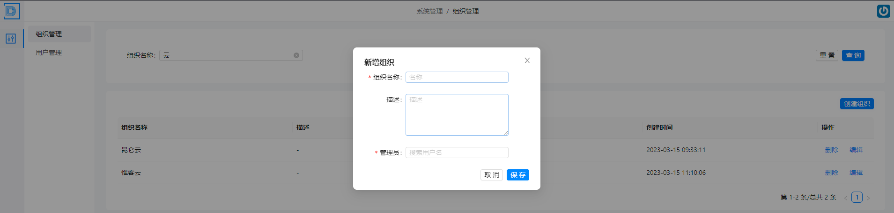
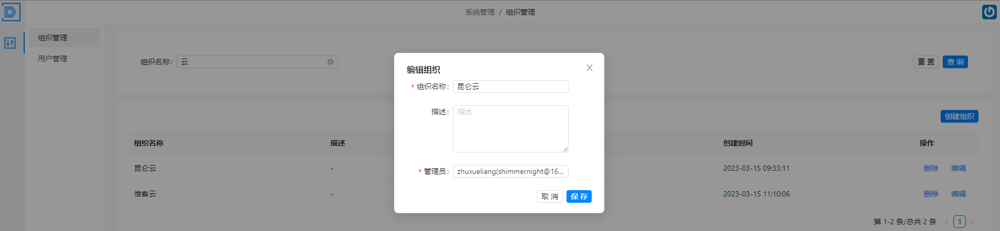
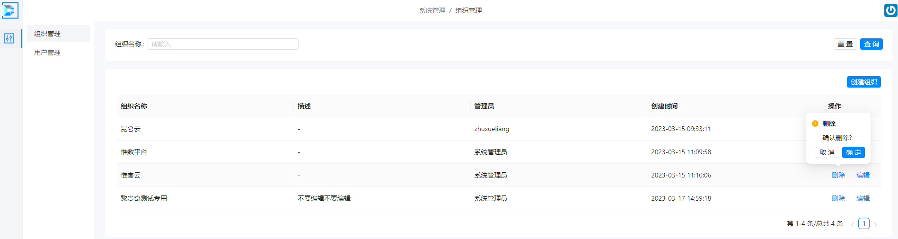
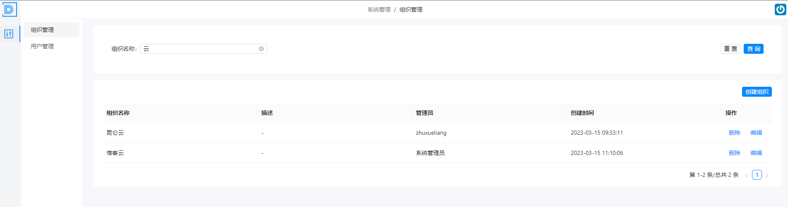
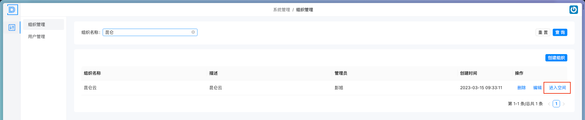
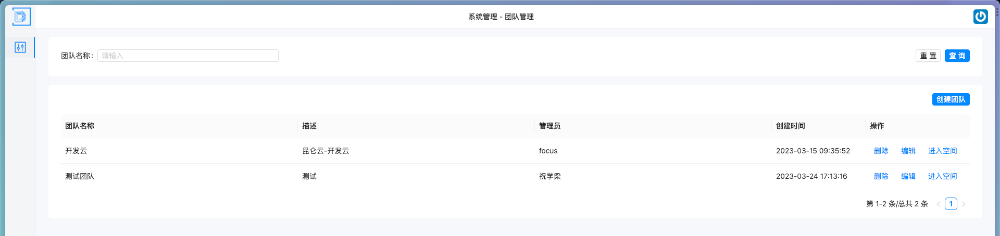

# 组织管理

> 描述：负责维护平台的组织体系和角色权限

### 1.1.1 组织创建

（1）点击组织管理模块，选择“添加组织”功能；

（2）在弹出的页面“组织名称”栏中输入组织名称，例如“昆仑云”；

（4）在“描述”栏中输入该部门的描述信息；

（4）在“管理员”栏中选择用户作为该部门的管理员；

（5）点击“保存”按钮，系统将自动创建该部门并分配唯一的组织ID。

 

### 1.1.2 组织更新

（1）进入组织管理模块，选择要编辑的组织；

（2）在组织详情中点击“编辑”按钮，进入编辑页面；

（3）在各栏中更新组织相关信息, 如组织名称、描述、关联管理员等；

（4）完成修改后，点击“保存”按钮，组织信息更新成功并返回组织详情页。

 

### 1.1.3 组织删除

（1）点击组织管理模块，选择要删除的组织；

（2）在组织详情中点击“删除”按钮，系统会弹出确认框进行二次确认；

（3）点击确认后，该组织将被标记为删除状态并移除组织列表。

需要注意的是，在进行组织删除操作时，需要进行二次确认，以防止误删；组织删除成功后，将无法恢复已删除的组织信息，请谨慎操作。

 

### 1.1.4 组织查询

（1）点击组织管理模块，选择“查询组织”功能；

（2）在弹出的查询页面中输入关键词，例如“昆仑云”；

（3）点击“查询”按钮，系统将返回与输入关键词匹配的组织列表，用户可以选择查看所需部门信息。

需要注意的是，在进行组织查询操作时，可以使用关键词搜索来缩减查询的范围，便于快速查找所需部门信息。

 

### 1.1.5 组织跳转

（1）点击组织管理模块，选择“进入空间”功能，即可快速跳转到对应组织管理界面；

 

（2）进入组织对应的团队管理界面

 
