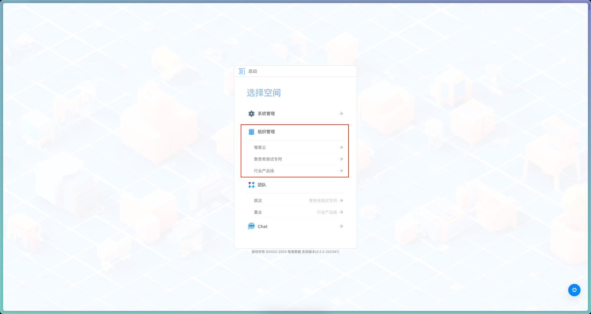
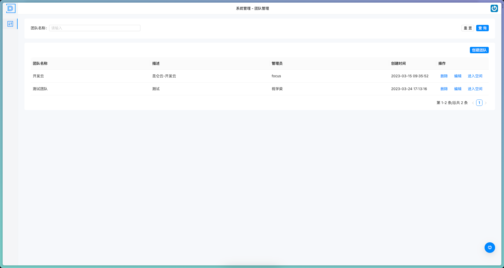

# 组织团队管理

> 描述：本模块为 组织管理员 提供了组织管理的子模块，帮助其管理自己的组织

## 2.1 进入组织

> 描述：进入当前账号管理的组织

（1）当系统管理员将当前账号关联到组织后（1.1.1），可以在选择空间中看到自己管理的组织列表；

 

（2）点击进入组织后，可以对当前组织下的团队进行管理
 

## 2.2 [团队管理](组织团队管理/团队管理.md)

> 描述：对当前组织下的团队进行管理和维护

## 2.3 [团队成员管理](组织团队管理/团队成员管理.md)

> 描述：负责管理团队下的成员信息，授权团队的访问权限；