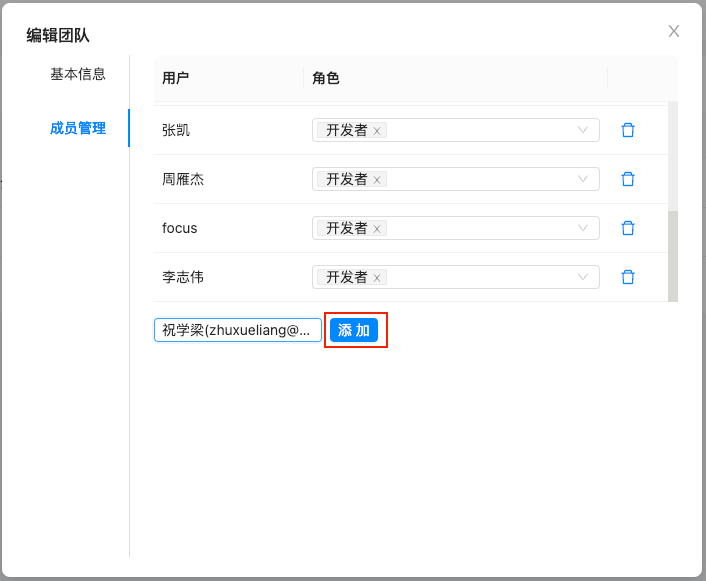
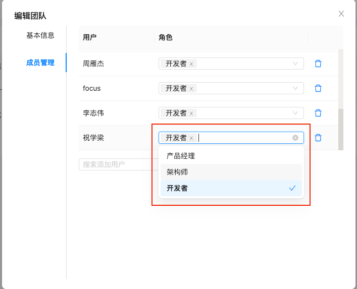
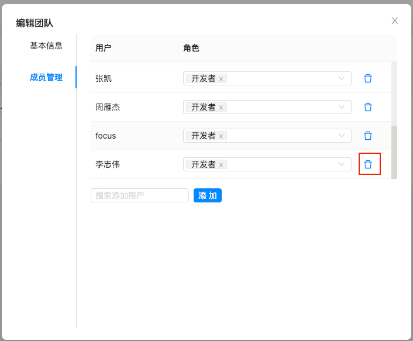

# 2.3 团队成员管理

> 描述：负责管理团队下的成员信息，授权团队的访问权限；

### 2.3.1 团队成员绑定

（1）点击团队成员管理模块，选择“添加团队成员”功能；

（2）在页面“成员名称”栏中搜索团队名称，例如“张三”；

（3）点击“添加”按钮，系统将自动关联该团队成员。

需要注意的是，在进行用户查询操作时，除了使用名称搜索，也可以使用邮箱搜索来缩减查询的范围，便于快速查找所需用户。
 

### 2.3.2 团队成员更新角色

（1）点击团队成员管理模块，找到需要更新角色的用户；

（2）在页面“成员角色”栏中选择角色，例如“开发者”；
 

### 2.3.3 团队成员解绑

（1）点击团队成员管理模块，选择要删除的团队成员；

（2）在团队成员详情中点击“删除”按钮，该成员将被移除成员列表。
 
