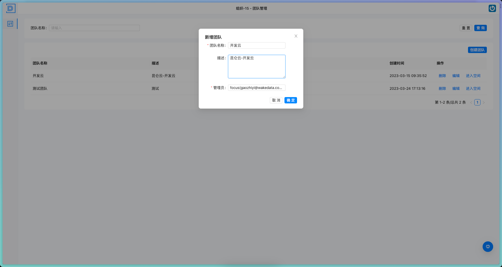
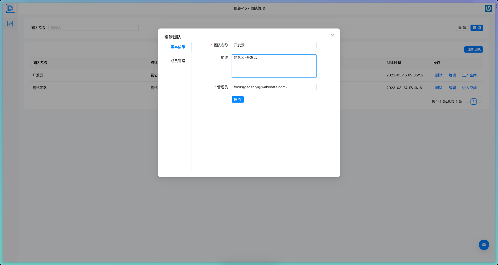
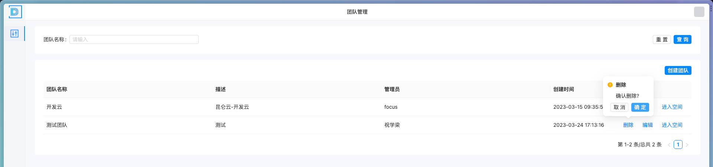
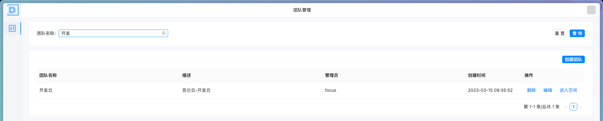
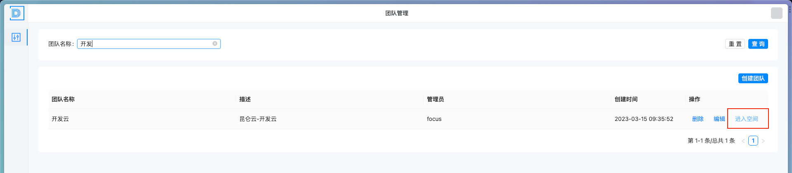
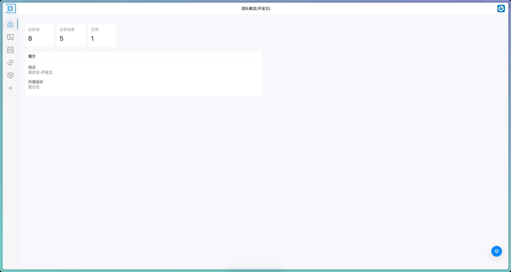

# 团队管理

> 描述：对当前组织下的团队进行管理和维护

## 2.2.1 团队创建

（1）点击团队管理模块，选择“添加团队”功能；

（2）在弹出的页面“团队名称”栏中输入团队名称，例如“开发云”；

（4）在“描述”栏中输入该团队的描述信息；

（4）在“管理员”栏中选择用户作为该团队的管理员；

（5）点击“保存”按钮，系统将自动创建该团队并分配唯一的组织ID。
 

## 2.2.2 团队更新

（1）进入团队管理模块，选择要编辑的团队；

（2）在团队详情中点击“编辑”按钮，进入编辑页面；

（3）在各栏中更新团队相关信息, 如组织名称、描述、关联管理员等；

（4）完成修改后，点击“保存”按钮，团队信息更新成功并返回团队详情页。
 

## 2.2.3 团队删除

（1）点击团队管理模块，选择要删除的团队；

（2）在团队详情中点击“删除”按钮，系统会弹出确认框进行二次确认；

（3）点击确认后，该组织将被标记为删除状态并移除团队列表。

需要注意的是，在进行团队删除操作时，需要进行二次确认，以防止误删；团队删除成功后，将无法恢复已删除的团队信息，请谨慎操作。
 

## 2.2.4 团队查询

（1）点击团队管理模块，选择“查询团队”功能；

（2）在弹出的查询页面中输入关键词，例如“开发云”；

（3）点击“查询”按钮，系统将返回与输入关键词匹配的团队列表，用户可以选择查看所需团队信息。

需要注意的是，在进行团队查询操作时，可以使用关键词搜索来缩减查询的范围，便于快速查找所需团队信息。
 

## 2.2.5 团队跳转

（1）点击团队管理模块，选择“进入空间”功能，即可快速跳转到对应团队管理界面；
 

（2）进入团队对应的团队首页
 