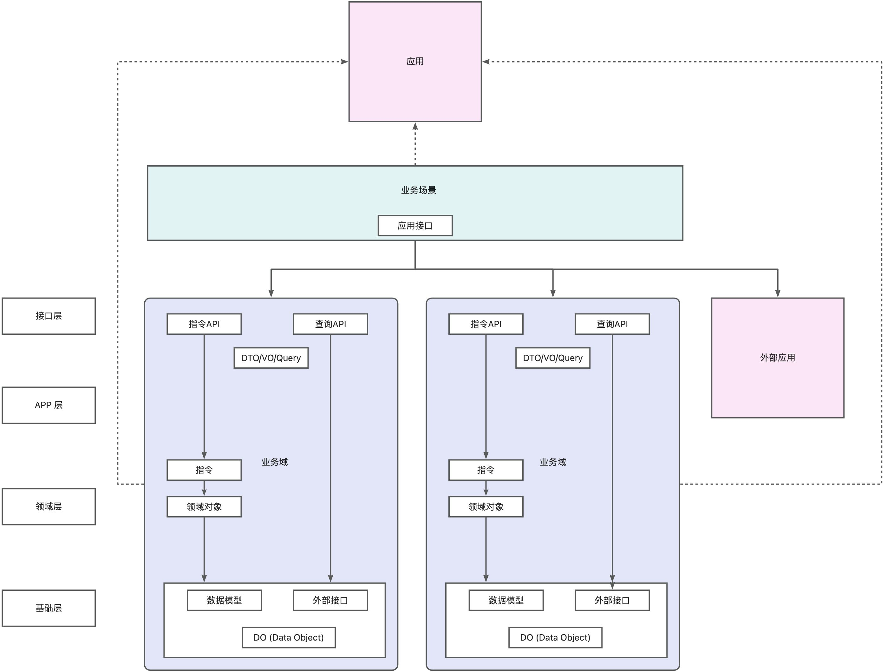
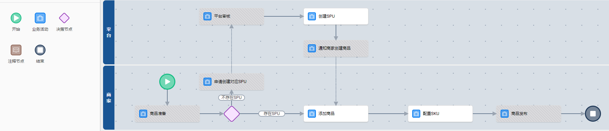
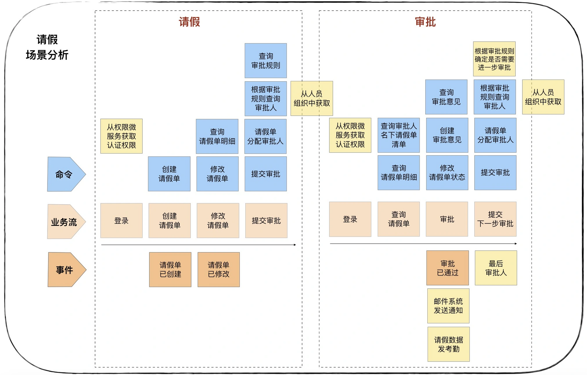
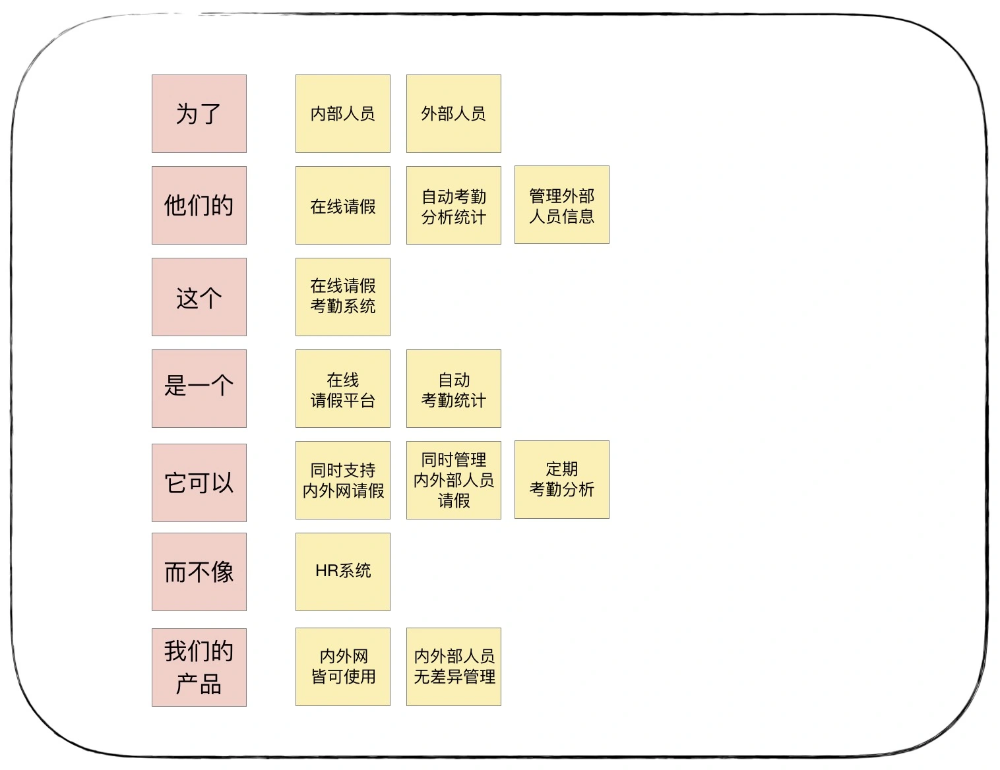
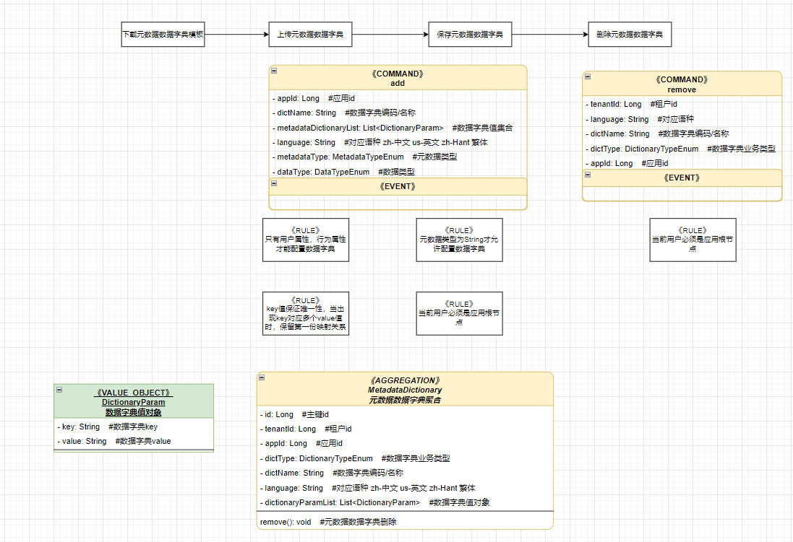
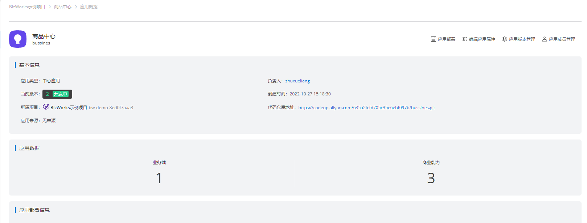
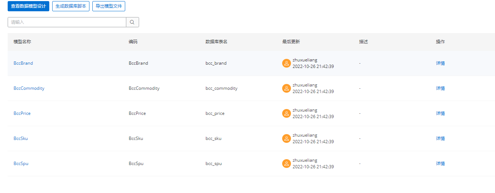
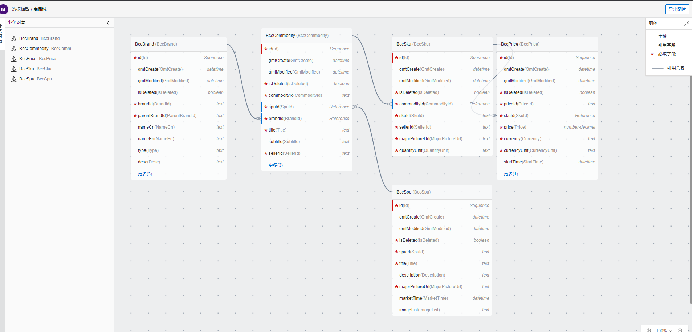

# 考虑的维度

- 使用便利性维度 -> 人，灵活、 -> 二义性、歧义 -> 易用性
- 标准、管理、约束维度 -> 机器, 通过形式化 -> 过程、结果标准化，

# 概览

 

# 业务场景

**定义**：主要表现形式就是一个业务流程图，用于表示业务场景下，各个角色的交互行为
**输入角色**：产品
**关联角色**：产品，架构师，开发
**包含内容**： 开始，业务活动，决策节点，注释节点，结束，版本号管理
**规则**：

- 在领域模型图完成之后，架构师可以对业务场景中的业务活动绑定业务域中提供的能力，
- 若一个业务活动绑定的多个领域的能力，则需要考虑是否需要拆分多个业务活动
- 一个业务活动可以绑定同一个领域的多个能力
- 一个业务域在同一个场景下版本号是一致的

**输入时机**

- 领域建模之前，产品输入

**应用场景**：

- 产品：应用于梳理产品的业务逻辑
- 架构师：在领域模型图构建前的必要知识，作为场景分析的主线流程的输入
- 应用概览图：构建领域，应用上下文依赖关系的依据
- 对专业领域业务知识的沉淀

**表现形式
**： 

# 场景分析

**定义**：基于产品业务流程的输入，分析业务流的完整性，业务流节点产生的业务规则
**输入角色**：产品，架构师，开发者
**关联角色**：产品，架构师，开发，测试，业务，项目经理
**包含内容**：指令，事件，业务流， 规则
**规则**：

- 通过分析产品的愿景，核心价值驱动，带入角色分析业务场景的完整性
- 业务规则：执行业务流节点是他的约束是什么， 执行业务流节点后他产生的影响是什么

**输入时机**

- 在领域建模前期

**应用场景**：

- 作为沟通的桥梁，统一了业务与技术对业务的表达方式
- 指导开发人员编写代码， 指导测试人员写测试用例，指导产品检测验收标准

**表现形式**

 

# 统一语言

**定义**：统一语言（Ubiquitous Language）是一种业务方与技术方共同使用的共同语言（Common
Language），业务方与技术方通过共同语言描述业务规则与需求变动，并且与团队达成一致
**输入角色**：产品，架构师，开发者
**关联角色**：产品，架构师，开发，测试，业务，项目经理
**包含内容**：统一的领域术语， 领域行为的描述
**范围**：团队， 应用，业务域
**规则**：

- 在领域建模过程中，我们往往需要在文档中建立一个大家一致认可的术语表。
- 统一语言贯穿了产品需求，架构设计，代码编写，测试， 验收的全流程。
- 统一语言在同一个范围内则不能存在二义性
- 在维护领域术语表时，一定需要给出对应的英文术语，否则可能直接影响到代码实现
- 为难以理解的术语提供具体的案例。

**输入时机**

- 贯穿整个领域建模的设计，产品，架构师，开发者

**应用场景**：

- 在需求分析，领域建模，详细设计过程中作为沟通的桥梁，统一了业务与技术的表达方式
- 在统一语言达成共识之后， 最终还会体现在代码上
- 构建领域，应用上下文依赖关系的依据
- 后期业务知识的沉淀
- 领域建模中类名，方法名，属性等字段的自动补全，代码的拼写检查

**表现形式**：

| 概念 | 英文        | 定义            | 约束                             | 举例                             | 范围   |
|----|-----------|---------------|--------------------------------|--------------------------------|------|
| 资源 | Resource  | BD进行销售活动的对象   |                                | POI                            | 全局   |
| 公海 | PublicSea | 业务目标限定的模拟资源全集 | 也业务目标对应，比如交易公海是为了做交易，推广公海是为了推广 | 业务目标是团购买单合作，限定POI为到餐全国和综合58同城的 | SCRM |

**统一语言哪里来**

- 如果我们长期处于某个领域的话，肯定会有一些俗语，俗话，术语，常用语，技术用语，活动概念。如果在领域专家和开发人员之间也能建立一种语言，是不是就可以让他们使用这种语言进行交流，进而解决沟通不顺畅的问题。

# 产品愿景

**定义**：产品愿景是对产品顶层价值设计，对产品目标用户、核心价值、差异化竞争点等信息达成一致，避免产品偏离方向
**角色**：产品
**关联角色**：产品，架构师，开发
**包含内容**：产品目标用户、核心价值、差异化竞争点
**规则**：

- 尽可能使用一句话描述清楚

**应用场景**：

- 明确系统建设重点，统一团队建设目标和建立通用语言

**示例**

- 为了满足内外部人员，他们的在线请假、自动考勤统计和外部人员管理的需求，我们建设这个在线请假考勤系统，它是一个在线请假平台，可以自动考勤统计。它可以同时支持内外网请假，同时管理内外部人员请假和定期考勤分析，而不像
  HR 系统，只管理内部人员，且只能内网使用。我们的产品内外网皆可使用，可实现内外部人员无差异管理

 

# 领域模型图

定义：描述业务领域内的业务实体，业务行为，以及实体之间的关系
角色：产品
关联角色：产品，架构师，开发
包含内容： 指令(支持配置定时任务、事件、Web RPC等来源)，事件，领域对象（聚合根，实体， 值对象， 仓储）领域服务，视图
规则：在领域模型图完成之后，架构师可以对业务场景中的业务活动绑定业务域中提供的能力
应用场景：

- 产品：产品做过程验收时，能实时的看到开发设计的变化
- 架构师：描述业务流程，以及业务的规则的体现
- 开发者：可以按照模型图指导进行编码

表现形式：
 
领域模型图在代码生成脚手架生成时，会映射到controller, rpc 的接口实现。 在后续做双向同步时则只修改属性，方法签名，以及类的名字即可。

# 业务概览图

定义：业务域的总览图，可以 映射定位到业务域的各个环节
角色：产品
关联角色：产品，架构师，开发
包含内容： ER图统计数据， 统一语言统计量，领域模对象的统计，接口数量统计，产品愿景，版本记录，领域的能力图谱（提供的api，提供的事件，消费的事件，定时任务）
规则：全局的描述了应用的信息， 会显示更新日志
应用场景：

- 产品：产品做过程验收时，能实时的看到开发设计的变化
- 架构师：在各个维度对架构的描述，关系等， 更有益于架构的设计
- 开发者：在做二开的时候，更方面的收集资料

表现形式：

# 应用概览图

定义：应用的总览图，可以 映射定位到应用的各个环节
角色：产品，架构师
关联角色：产品，架构师，开发
包含内容： 应用基本信息， ER图统计数据，
统一语言统计量，领域模对象的统计，接口数量统计，产品愿景，版本记录，业务场景图，产品愿景，应用的能力图谱（提供的api，提供的事件，消费的事件，消费的api），上下文映射图（关联了哪些应用、业务域），版本号的统计数据
规则：全局的描述了应用的信息， 会显示更新日志
应用场景：

- 产品：产品做过程验收时，能实时的看到开发设计的变化
- 架构师：在各个维度对架构的描述，关系等， 更有益于架构的设计
- 开发者：在做二开的时候，更方面的收集资料

表现形式：
 

# ER 图

**定义**：描述产品需要达成的目标
**角色**：产品
**关联角色**：产品，架构师，开发
**包含内容**： 实体，属性，关系
**规则**：

- 业务聚合类的数据表， 尽可能简单
- 查询类的数据表，针对存在条件查询的，尽可能多一些冗余

**应用场景：**

- 业务数据存储
- 视图数据的存储

**表现形式**：

- 数据表的列表

 

- ER 关系图

 

#### 附录

[18 | 知识点串讲：基于DDD的微服务设计实例-极客时间](https://time.geekbang.org/column/article/169881)
