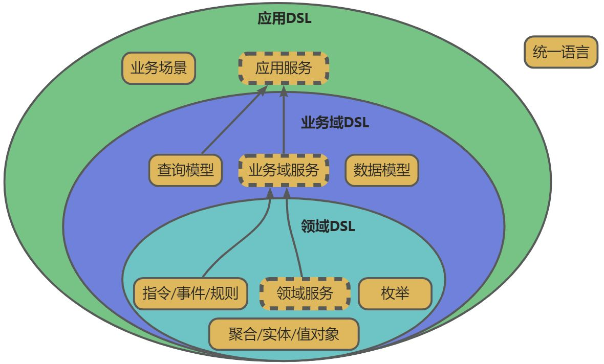
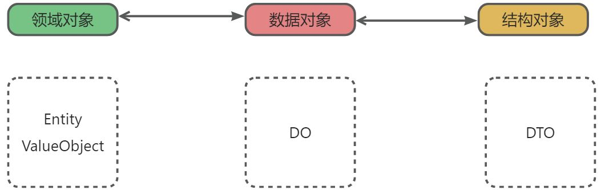

<br/>

# 我们想要一个什么样子的DSL

- 我们想要一个DSL，它能够描述DDD风格的**领域模型**。
- 这个DSL允许我们在一个地方集中记录和展示领域模型中的**关键元素**。
- 这个DSL应该能在**概念层面描述领域模型**，也允许我们在其中添加领域模型在实现层面需要的细节。
- 这个DSL 应该能描述**各个应用，业务域，团队，组织之间的关系**是什么？
- 我们希望它能够支持代码生成工具以产生与领域模型之间具备**亲密映射关系的软件代码**。
- 我们希望软件的文档——包括使用Swagger/OpenAPI、RAML描述的**RESTful API文档**，
- 定义**数据库Schema**的DDL代码，领域模型中关键状态的状态机图等——都尽可能自动化地产生。
- 我们希望生成所谓的**Client SDK**，我们甚至希望能直接生成有UI的**客户端应用**，
- 至少生成一些程序员在实现客户端应用的UI/UE（用户体验）时可以使用的**脚手架代码**…
- 希望基于这个DSL可以制造一个**工具链，最终形成一个跨语言**
  的、可以支持大型业务软件开发的平台（PaaS）。这个开发平台对开发人员应该提供足够的约束，让他们少干傻事，少干超出自己能力范围的事情

# 原则

- 不同层面的 DSL 关注点不同，但最终的目的都是完整的表示 DDD 领域建模的结果
- DSL 是可读的
- DSL 是可以序列化的
- DSL 是形式化的，不应该存在歧义。也就是说 DSL 是机器可以解析的。
- DSL 不存储计算结果，它是声明过程
- DSL 会参与版本化

# 概览

<br/>

# 应用DSL

**概念定义**：描述一个应用[微服务-限界上下文]的特定语言，描述部分有
**使用对象**： 领域专家，架构师，产品，开发
**核心价值**：

- 划定边界

```typescript
type Versionable = {
    // 版本号
    version: string
}

type Name = {
    title?: string           // 中文名称
    name: string             // 唯一英文标识符
    description?： string     // 详细描述信息，默认为空字符串
    // 元数据，由开发者自行扩展,  DSL 本身不会关心其内容，DSL 消费者会关心
    meta?: { [key: string]: string }
}


type Application = Name & Versionable & {
    package: string                                  // 包名
    businessDomains: BusinessDomain []               // 业务域
    businessScenarios: BusinessScenario []            // 业务场景
}
```

# 业务域DSL

**概念定义**：描述一个完整业务提供的原子能力，以及实现细节
**使用对象**： 领域专家，架构师，产品，开发
**核心价值**：

- 业务能力抽象
- 业务实现细节

```typescript
type BusinessDomain = Name & Versionable & {
    domainModel: DomainModel             // 领域模型
    dataModel: ERModel                   // 数据模型
    queryModel: QueryModel						  	// 查询模型
    objectMapper: ObjectMapperModel			  // 结构化对象映射
    vision: string                         // 产品愿景
    document: string                      // 需求资料
}


// 查询模型
type QueryModel = {
    queries: Query[]
    dtos: DTO[]
    // enums: Enum[]
}

// 结构化对象映射
type ObjectMapperModel = {
    mappers: ObjectMapper[]
}


```

# 领域DSL

**概念定义**：描述一个业务的核心业务能力，不涉及实现
**使用对象**： 领域专家，架构师，产品，开发
**核心价值**：

- 领域的核心逻辑抽象

```typescript

// 领域模型
type DomainModel = {
    // 聚合
    aggregates: Aggregate[]
}


type Entity = Class & {
    id: Property
}

type ValueObject = Class

// Data Transfer Object
type DTO = Class

// Data Object
type DO = Class


type Aggregate = Name & {
    // 聚合根, 指定实体名称
    root: Entity
    // 实体, 默认为 []
    entities?: Entity[]
    // 非聚合值对象，默认为 []
    valueObjects?: ValueObject[]
    // 枚举，默认为 []
    enums?: Enum[]
    // 命令
    commands: Command[]
}

// 领域事件
type DomainEvent = Name & {
    // 属性
    properties: Property[]
}

type Rule = Name & {}

type CommandSource = {
    type: 'http'
} | {
    type: 'rpc'
} | {
    type: 'event'
    // 事件名
    value: string
} | {
    type: 'schedule'
    // cron 表达式
    value: string
}

// 绑定的仓储能力
type Repository = 'create' | 'modify' | 'remove'


// 指令执行器，存在默认模板
type Handler = Class

type Command = Name & {
    // 命令的触发来源，默认为 http, rpc 两种类型， 优先使用query,command 上设定的
    source?: CommandSource[]
    // 绑定的仓储能力
    repository: Repository
    // 命令分类，小写，可选，会影响 java 包结构，如果未提供，则为 name
    category?: string
    // 命令属性
    properties: Property[]
    // 执行器, 默认 Handler 为 ·命令名称 + Handler· 连接起来的类， 有固定的实现逻辑
    handler?: Handler
    // 事件, 即命令执行完成之后的触发的领域事件，默认为 []
    event?: DomainEvent
    // 事件是否是需要发送  false 不发送，true 发送
    eventSendable?: false
    // 规则， 默认为 []
    rules?: Rule[]

    // 命令返回值，默认为 空。 备注：可能不符合 CQRS 严格定义
    return?: Return
}
```

# 协议设计

？ -> 标识一个可选的字段

## 类型系统

```typescript
type Type = string

// 基本类型、集合类型，对象类型、枚举
// 参考bizworks
// 示例
// 基础 类型，Long, String
// 集合类型 List<String>, Set<String>, Map<Integer, String>
// 引用类型 [name:uuid], name 为类型名称, uuid 为类型的唯一id, 
//         [Foo:12123-1231dad-121adad-123saddsaf]
//         List<[MyType:12123-1231dad-121adad-123saddsaf]>
//         Map<String, [MyType:12123-1231dad-121adad-123saddsaf]>
```

## 类的定义

```typescript
type Access = 'public' | 'private' | 'protected'


// 类属性
type Property = Name & {
    // 数据类型
    type: Type,
    // 访问控制, 默认 public
    access?: Access
    /**
     * 是否可选，比如 Java 场景，生成代码会携带 @Nullable 注解，默认为 false
     */
    optional?: boolean
}

/**
 * 方法参数
 */
type Parameter = Name & {
    // 参数类型
    type Type
    /**
     * 是否可选，比如 Java 场景，生成代码会携带 @Nullable 注解
     */
    optional?: boolean
}

type Return = {
    type: Type
}

type MethodDefine = {
    // 描述
    description?: string,

    // 方法参数
    parameters: Parameter[]

    // 返回值
    return: Return
}

type Method = Name & {
    // TODO: 目前不支持重载
    signature: MethodDefine
    // 访问控制, 默认是 public
    access?: Access
    // 是否是抽象方法，默认是 false
    abstract?: boolean
}

type Interface = Name & {
    // 扩展的接口列表，默认为 []
    implements?: Interface[]
    // 实例属性,某些特定语言存在, 默认为 []
    properties?: Property[],
    // 实例方法, 支持方法重载, 默认为 []
    methods?: Method[]
}


type Class = Name & {
    // 继承, 默认为 null
    extends?: Class
    // 扩展的接口列表，默认为 []
    implements?: Interface[]
    // 抽象类，默认为false
    abstract?: boolean

    // 类实例属性, 默认为 []
    properties?: Property[],
    // 类实例方法, 支持方法重载, 默认为 []
    methods?: Method[]

    // 类属性, 静态属性，默认为 []
    classProperties?: Property[]
    // 类方法，静态方法，默认为 []
    classMethods?: Method[]
}


```

## 枚举

```typescript
type EnumMember = Name & {
    // 成员值
    code: number | string
}

type Enum = Name & {
    baseType: 'number' | 'string'
    members: EnumMember[]
}
```

## 查询

```typescript
type QuerySource = {
    type: 'http'
} | {
    type: 'rpc'
}


// 请求
type Query = Name & {
    // 查询的触发来源，默认为 http, rpc 两种类型
    source?: CommandSource[]
    // 查询的参数实体
    properties: Property[]
    // 分页返回
    pagination: boolean
    // 执行器, 默认为 ·查询名称 + Exe· 连接起来的类， 有固定的实现逻辑
    handler?: Class
    // 规则， 默认为 []
    rules?: Rule[]

    // 查询返回值
    return: Return
}
```

## 对象关系映射

```typescript
type ObjectFieldMapper = {
    sourceField: string
    sourceFieldId: string
    targetField: string
    targetFieldId: string
}

type ObjectReference
{
    // 类名
    name: string

    // 类唯一 id
    id: string

    // 对象类型
    type: 'entity' | 'valueObject' | 'dto' | 'dataObject'
    // 对于实体、值对象等领域对象 parent 为聚合的标识符
    // dto、dataObject 则为空
    parent ? : string
}

type ObjectMapper = Name & {
    // 来源类型， 类型必须存在，必须是 Class或 Class 的子类型
    source: ObjectReference
    // 目标类型，类型必须存在，必须是 Class或 Class 的子类型
    target: ObjectReference
    // 定义 source 属性到 target 的映射规则
    // 举例：
    // {a: 'b', c: 'd'}, 将 source a、c 分别映射到 target 到 b、d
    // 属性的类型必须保持一致
    mapper: ObjectFieldMapper[]
}
```

### 转换范围

<br/>

### 嵌套对象转换规则

- 领域对象 ----> 数据对象
    - 嵌套的值对象，实体 都可以选 数据对象的JSON 类型
- 结构对象 -----> 数据对象
    - 嵌套的值对象，实体 都可以选 数据对象的JSON 类型

### 字段类型的兼容性

| Java 类型  | mysql 类型  |
|----------|-----------|
| Integer  | int       |
|          | bigInt    |
| Decimal  | decimal   |
| Float    | float     |
|          | double    |
| Double   | double    |
| Long     | bigint    |
| DateTime 
 Date     | timestamp |
|          | datetime  |
|          | date      |
| String   | longtext  |
|          | text      |
|          | varchar   |
| Boolean  | smallint  |
|          | int       |
| Object   | json      |

## 业务场景

```typescript

type DomainDependency = {
    // 团队 Id, 跨团队关联时需要
    teamId?: string

    // 依赖业务域 ID
    domainId: string

    // 业务域版本号 ID
    versionId: string

    // 服务id, 查询或者指令的 uuid
    serviceId: string
}

type ExternalDependency
{
    name: string
    description ? : string
}


// 业务场景
type BusinessScenario = Name & {
    // 版本
    version: string

    // 依赖的业务域服务
    domainDependencies: DomainDependency[]

    // 外部依赖
    externalDependencies: ExternalDependency[]

    // 业务场景服务，直接复用查询模型
    serviceModel: QueryModel
}
```

##  

##  

##  

## 数据建模

```typescript

// 数据模型
type ERModel = {
    dataObjects: DataObject[]
    // 引用关系
    references: DataObjectReference[]
}

type DataObjectReference = {
    source: string // NameOf<DataObject>, DataObject 标识符
    sourceId: string
    // [{field: a, target: 'A'}, {field: a, target: 'A'}]
    targets: Array<{
        // 目标表
        target: string // NameOf<DataObject>, DataObject 标识符
        targetId: string
        // 关联关系
        cardinality: 'OneToOne' | 'OneToMany' | 'ManyToMany' | 'ManyToOne'
        // 字段映射
        mapper: Array<{
            sourceField: string
            targetField: string
        }>
    }>
}


// 数据类型，定义数据库无关的
type DataType =
    'Boolean'
    | 'Text'
    | 'LongText'
    | 'Date'
    | 'DateTime'
    | 'Timestamp'
    | 'Integer'
    | 'Long'
    | 'Double'
    | 'Float'
    | 'Decimal'
    | 'String'
    | 'JSON'
// TODO: 与 mysql 类型的映射关系


// 数据的属性
type DataProperty = Name & {
    // 表字段名，默认为 name 的 snake_case 模式
    propertyName?: string

    // 数据类型
    type: DataType

    // 根据具体数据类型确定，Text, LongText 不支持
    defaultValue?: any

    // 长度修饰符 默认为 0， 仅支持 String 类型
    length?: number

    // 不为空，默认false, 另外也会受主键影响
    notNull?: false

    // 是否自增， 默认为false，仅支持 Long Integer Float Double
    autoIncrement?: false

    /**
     * 精度, 默认 10, 最大为 65, 仅 Decimal 支持
     */
    precision?: number;

    /**
     * 小数位, 默认 0,仅 Decimal 支持
     */
    scale?: number;
}


type IndexType = 'Normal' | 'Unique' | 'Primary' | 'FullText'

type IndexMethod = 'BTREE' | 'HASH'

type DataIndex = Name & {
    // 默认为 Normal
    type?: IndexType
    // 索引栏位，通常以数据对象的属性名称
    properties: string[]
    // 默认为BTREE
    method?: IndexMethod
}

// 数据模型
type DataObject = Name & {
    //  表字段名，默认为 name 的 snake_case 模式
    tableName?: string
    // 字段
    properties: DataProperty[]
    // 索引，默认为 []
    indexes?: DataIndex[]
}
```

数据类型详细描述：

| 类型        | mysql 类型  | 支持自增 | 支持默认值 | 支持长度 |
|-----------|-----------|------|-------|------|
| Integer   | int       | √    | 0     |      |
| Decimal   | decimal   |      | √     |      |
| Double    | double    | √    | 0     |      |
| Long      | bigint    | √    | 0     |      |
| Timestamp | timestamp |      |       |      |
| DateTime  | datetime  |      |       |      |
| Date      | date      |      |       |      |
| LongText  | longtext  |      |       | √    |
| Text      | text      |      |       | √    |
| String    | varchar   |      |       | √    |
| Boolean   | smallint  |      | 0     |      |
| Reference | 取决于被引用类型  |      |       |      |
| JSON      | json      |      |       |      |

## DSL 规则

### 聚合内的引用规则（聚合根，实体，值对象，指令，事件）

- 所有引用对象都只能是聚合内部的声明的对象

### 聚合根

- 属性：领域内内部的：实体和值对象
- 方法签名：领域内部的：实体，值对象，指令

### 实体

- 属性：领域内内部的：实体和值对象
- 方法签名：领域内部的：实体，值对象，指令

### 值对象

- 属性：领域内内部的：实体和值对象
- 方法签名：领域内部的：实体，值对象，指令

### 指令

- 属性：领域内内部的：实体和值对象

### 事件

- 属性：领域内内部的：实体和值对象

# 扩展资料

- 对象关系：[依赖、关联、聚合、组合](https://zhuanlan.zhihu.com/p/359672087)
- [bizworks 领域模型](https://help.aliyun.com/document_detail/284687.html)
- UML 2.0 建模语言
- [dddml-spec](https://github.com/wubuku/dddml-spec)
- [开发者需要了解的领域特定语言（DSL）](https://zhuanlan.zhihu.com/p/110757158)
- [什么是领域专用语言 (DSL) | MPS，JetBrains 出品](https://www.jetbrains.com/zh-cn/mps/concepts/domain-specific-languages/)
- [11 | DSL：你也可以设计一门自己的语言-极客时间](https://time.geekbang.org/column/article/248638?utm_source=related_read&utm_medium=article&utm_term=related_read)
