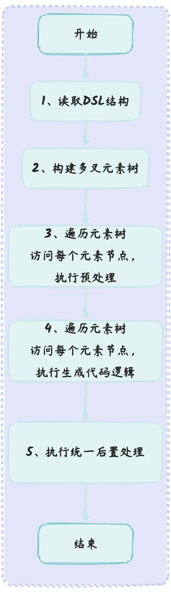
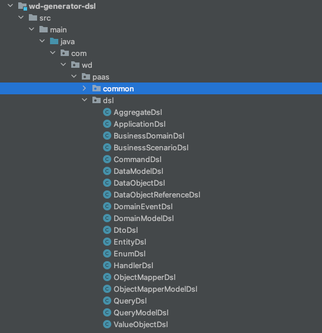
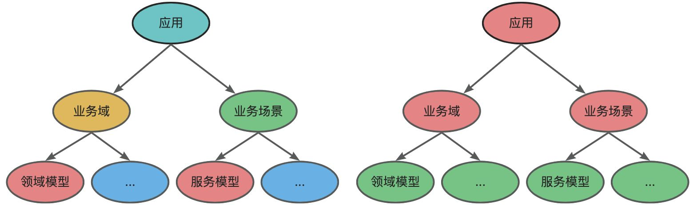
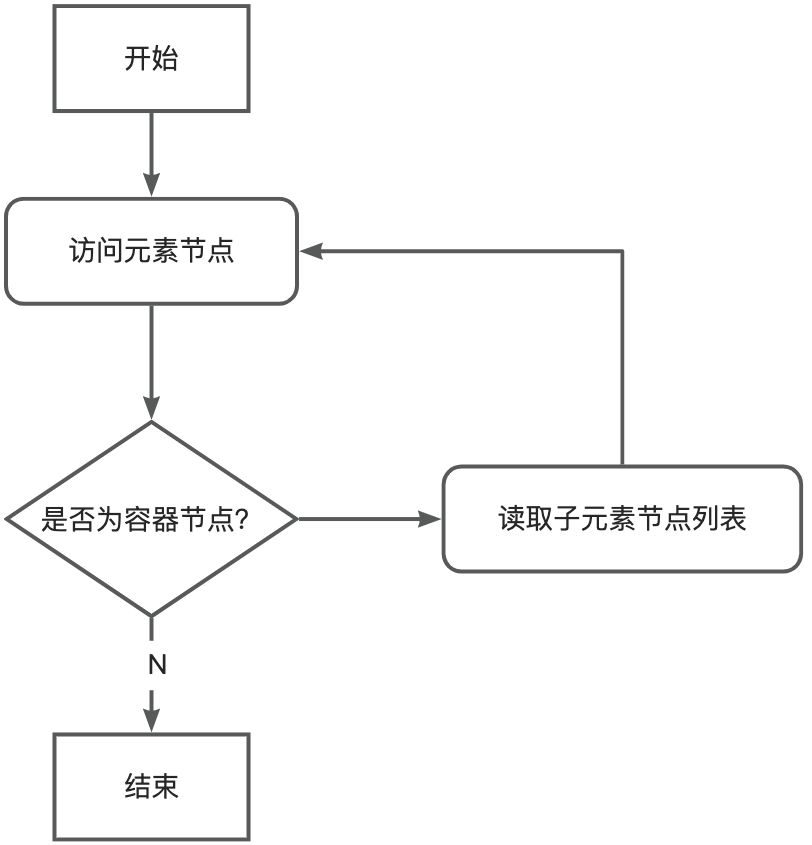
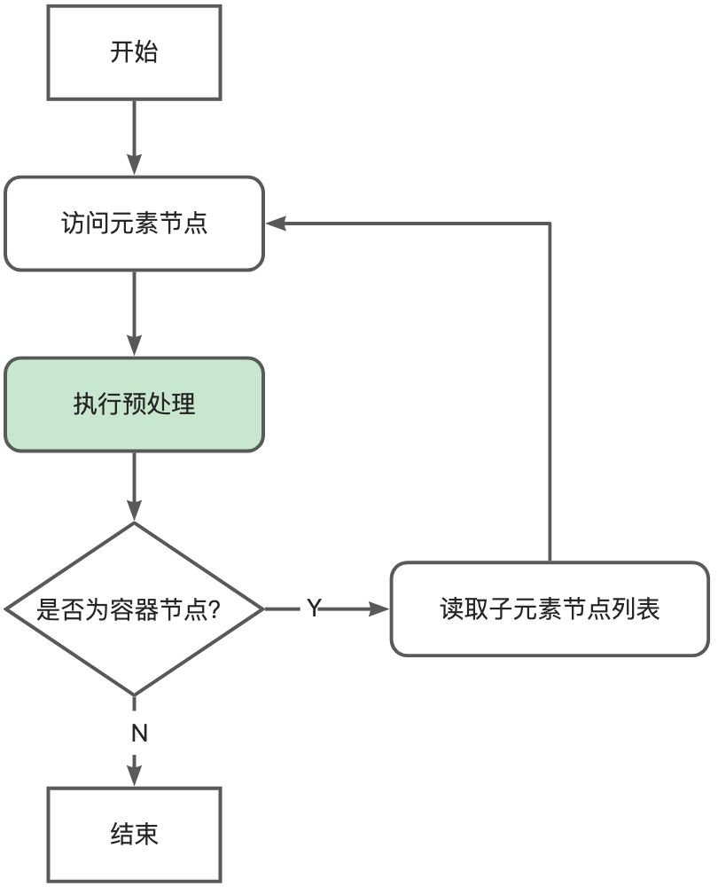
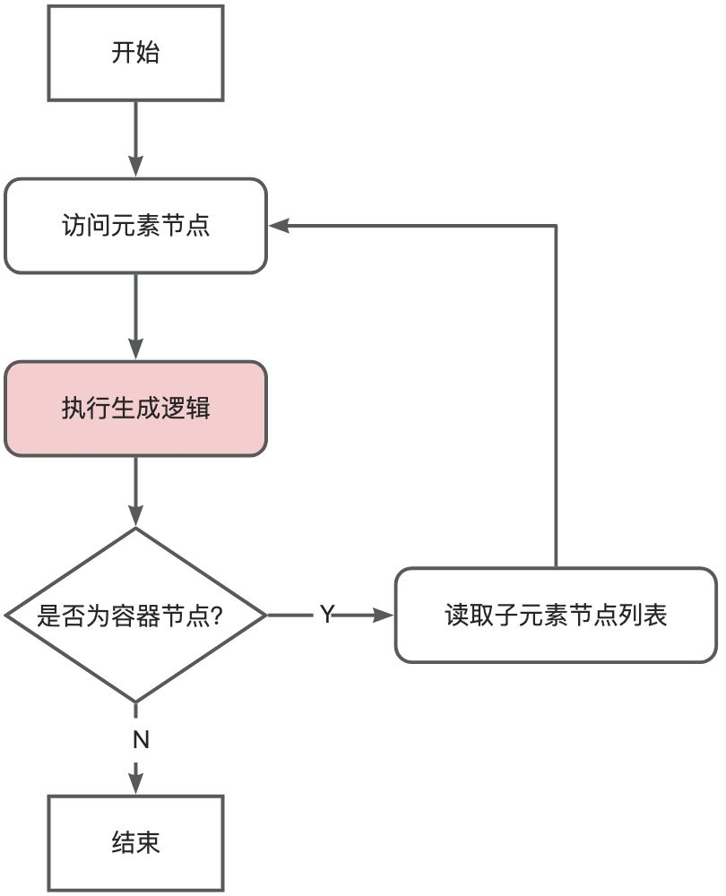
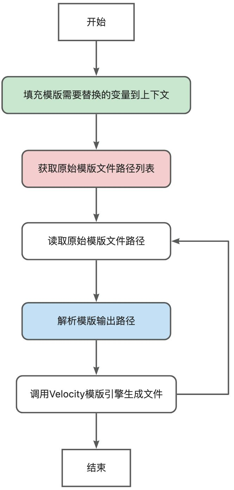

## 一、概述

为了简化开发者从设计模型到规范代码的实现，DDD可视化平台提供了一种平台模型到代码的单向生成功能。本文介绍DDD可视化平台单向生成功能，以及设计思路，将平台模型到代码的单向生成顺畅融入到已有的研发流程中，有效降低项目设计到编码初期的开发成本。

## 二、项目结构

```txt
wake-code-generator			
    ├── wd-generator-core		-- 核心模块
    └── wd-generator-dsl		-- DSL协议结构
```

## 三、流程设计

用户通过DDD可视化平台图形界面绘制模型后，前端根据 [DSL协议](./DDD可视化平台的DSL设计.md)
以json的形式组装DSL模型并返回给后端，后端需要依据DSL模型生成相应的源码文件并返回。为了实现DSL模型到源码文件的生成，本模块设计了如下流程：


### 1、读取DSL结构

依据 [DSL协议](./DDD可视化平台的DSL设计.md)，在dsl包下定义了相应的数据结构，用于接收DSL数据。


### 2、构建多叉元素树，并通过访问者遍历元素树

由于DSL数据结构较为复杂，采用直接遍历的方式将增加遍历的复杂度，为了降低遍历的复杂度、减少遍历代码的维护成本，我们将数据结构的复杂度转移到构建阶段，根据DSL构建一棵多叉树结构，简化遍历元素的过程。
多叉树节点分为如下类型：

1. ElementNode 元素节点：抽象的节点类型，包含一个指向父节点的属性；
2. CompositeElement 容器节点：继承 ElementNode，并包含一个子节点列表childElementNodeList，子节点类型可以为容器节点和叶子节点；
3. LeafElement 叶子节点：继承 ElementNode，代表树最下层节点。


原DSL结构 构建后的元素树结构
遍历思路：深度遍历，访问元素树结构，根据元素种类往叶子元素进行遍历；同时遍历到每个元素的同时，调用元素具体的访问方法


### 3、第一次遍历，访问每个元素节点(对元素的预处理)，访问者执行预解析逻辑

> Tips: 该阶段可以做一些数据预处理操作（关系缓存、字段修改）

根据深度遍历访问每一个元素并调用访问者提供的预处理方法；
访问者内部根据元素的类名获取元素相对应的策略类，并执行相对应的预处理策略


### 4、第二次遍历，访问每个元素节点(预处理后的元素)，访问者执行生成逻辑

> Tips: 该阶段为核心生成逻辑（代码生成、文件输出、流操作）

同上，根据深度遍历访问每一个元素并调用访问者提供的生成方法；
访问者内部根据元素的类名获取元素相对应的策略类，并执行相对应的生成策略


### 5、执行统一后置处理

对ThreadLocal线程上下文进行清理等统一后置处理操作。

## 四、访问者模式

> 由上述流程设计可知，访问者需要提供预处理、生成逻辑、后置处理等功能，因此定义一个访问者接口，具体逻辑由不同访问者实现。

```java
/**
 * 访问者, 提供具体元素的操作方法
 *
 * @author shimmer
 */
public interface Visitor {

    /**
     * 预解析元素方法
     *
     * @param elementNode 元素节点
     */
    void preHandle(ElementNode elementNode);

    /**
     * 元素生成方法
     *
     * @param elementNode 元素节点
     */
    void generate(ElementNode elementNode);

    /**
     * 统一后置处理方法
     */
    void globalAfterHandle();
}
```

### Velocity模版引擎实现生成逻辑

> 原理：Velocity模版引擎是一种静态生成模版文件的模版引擎，基于vm模版语法和模版上下文替换对应的模版变量，可以得到替换后的模版文件流。

实现逻辑：填充变量到Velocity上下文、获取需要生成的模版路径，然后将原始路径解析为输出路径，最后调用Velocity模版引擎生成新文件。

封装变化点：根据上述过程，将变量填充、模版路径列表获取、解析路径等变化点封装到接口中，由不同元素提供具体实现逻辑。

```java
/**
 * Velocity模版引擎生成接口
 *
 * @author ZhuXueLiang
 * @version 1.0
 */
public interface VelocityTemplateGenerate extends ElementStrategy {

    /**
     * 获取生成需要的模版路径列表
     *
     * @return 模版路径列表
     */
    List<String> getTemplatePathList();

    /**
     * 填充当前元素标签到上下文中,用于进行变量映射
     *
     * @param context velocity上下文
     */
    void putVelocityContext(VelocityContext context);

    /**
     * 解析输出路径
     *
     * @param templateUrl   需要解析的模版路径
     * @param preFixOutPath 目标路径
     * @return 输出路径
     */
    String parseOutputPath(String templateUrl, String preFixOutPath);

    /**
     * 处理逻辑(处理各个元素的单独逻辑)
     *
     * @param templateContext 上下文信息
     * @return true/false
     */
    Boolean process(TemplateContext templateContext);
}
```
